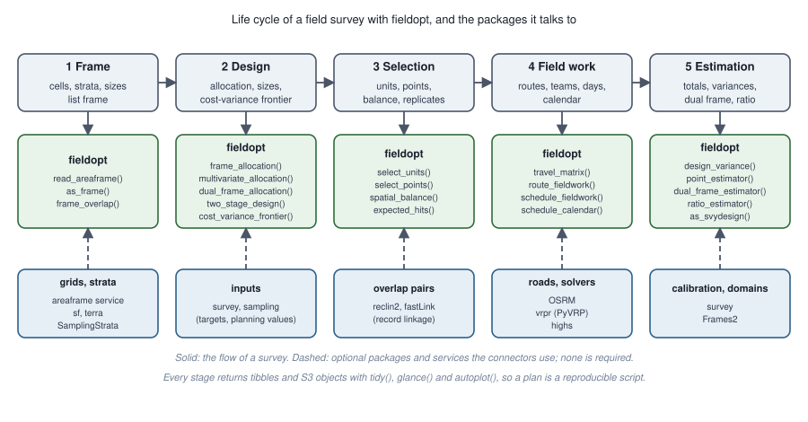
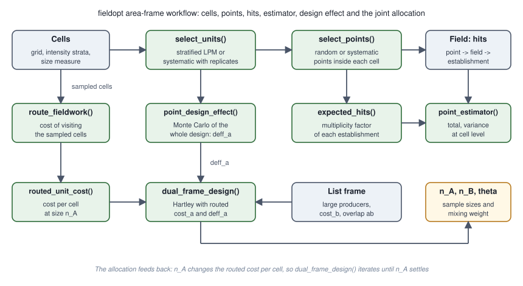

# fieldopt 

<!-- badges: start -->
[](https://github.com/castlaboratory/fieldopt/actions/workflows/R-CMD-check.yaml)
[](https://app.codecov.io/gh/castlaboratory/fieldopt)
[](https://lifecycle.r-lib.org/articles/stages.html#experimental)
<!-- badges: end -->

Area-frame and dual-frame survey design under real field cost. Survey samples
are usually designed for precision alone; the cost that actually decides
whether a survey happens is the field work: travelling between sampling units
and interviewing. `fieldopt` puts that cost next to the variance of the
estimator so that both are visible when the design is chosen, and provides
the pieces an agricultural survey with an area frame (grid cells, points
inside them) and a list frame needs.

- `travel_matrix()` builds the travel matrix between units from coordinates
  (great-circle or planar distances, optionally times a detour factor), from
  a road network through OSRM (durations or distances, in blocks), or wraps a
  matrix computed elsewhere.
- `field_cost_model()` turns travel, team-days, visits and interviews into
  money or time.
- `route_fieldwork()` routes the field work from a depot through the selected
  units, for one team or several, under daily limits of duration (travel plus
  the service time at each unit), stops and capacity, on symmetric or
  road-network matrices: exact up to 13 units, otherwise a hybrid genetic
  search with the optimal split of the tour and a granular local search
  (optimal on the classical TSPLIB instances and on 24 of the 27 Augerat CVRP
  set A instances, largest gap 0.15%), with the Held-Karp bound and a proof of
  optimality when it closes;
  `engine = "vrpr"` hands the same problem to the PyVRP solver.
- `schedule_fieldwork()` solves the multi-depot problem of several bases
  with their teams and days (assignment, routes and the number of team-days
  at once) and distributes the routes over the teams and the days available:
  a calendar that says whether the field work fits; `schedule_calendar()`
  redoes that distribution as an integer programme (through `highs`) with
  team availability, fixed assignments, precedences and shared team-days.
- `select_units()` draws a probability sample of segments or cells, within
  strata, by the local pivotal method (spatially balanced), by spatially
  ordered systematic sampling along a Hilbert curve with interpenetrating
  replicates, by the cube method balanced on auxiliaries, or by simple random
  sampling; `spatial_balance()` measures how evenly a sample covers the
  territory.
- `select_points()`, `expected_hits()` and `point_estimator()` implement
  point sampling inside the selected cells and the multiplicity estimator
  (each hit of an establishment counts, divided by its expected hits).
- `segment_estimator()` gives the closed, open and weighted segment
  estimators; `design_variance()` the Horvitz-Thompson total with the
  variance estimator that matches the design (local-mean, replicates, SRS);
  `ratio_estimator()` uses a known auxiliary total; `dual_frame_estimator()`
  combines the area and the list samples (Hartley with a fixed, screening or
  estimated weight; Fuller-Burmeister).
- `frame_allocation()` allocates across strata for a target variance or a
  budget; `multivariate_allocation()` does it for several study variables at
  once (Bethel); `dual_frame_allocation()` is Hartley's allocation for an
  area frame plus a list frame with overlap, with the optimal mixing weight
  or the screening design; `two_stage_allocation()` is Cochran's two-stage
  allocation with the cost function `c1 n + c2 n m`. `tidy()` and `glance()`
  read them all.
- `routed_unit_cost()`, `two_stage_design()` and `dual_frame_design()` close
  the loop: the cost of an area unit is measured by routing a sample of the
  allocated size, and the allocation is repeated until it stabilises.
- `point_design_effect()` simulates the whole area design (cells, points,
  hits, estimator) and returns the bias, the variance and the design effect
  of point sampling, the `deff_a` the dual-frame allocation asks for.
- `cost_variance_frontier()` simulates designs over a grid of sample sizes and
  returns the trade-off between field cost and variance.
- `as_frame()`, `as_sf()` and `read_areaframe()` move between spatial layers
  (or the cells exported by an area-frame service) and the plain frames the
  package works on; `frame_overlap()` matches a list frame to the cells and
  marks the overlap domain; `as_svydesign()` hands a sample to the `survey`
  package for calibration, domains and nonresponse adjustment.

The numerical engine is the Rust crate
[`fieldopt-core`](https://github.com/castlaboratory/fieldopt-core), usable on
its own from Rust or from other languages.

## Installation

The development version needs a Rust toolchain (`cargo` and `rustc` 1.70 or
later, from <https://rustup.rs>):

```r
# install.packages("pak")
pak::pak("castlaboratory/fieldopt")
```

## Example

```r
library(fieldopt)

set.seed(1)
frame <- data.frame(unit = c("depot", paste0("s", 1:40)),
                    x = c(5, runif(40, 0, 10)), y = c(5, runif(40, 0, 10)))
frame$crop <- c(NA, 20 + 3 * frame$x[-1] + rnorm(40))

model <- field_cost_model(per_travel = 2, per_unit = 30, per_interview = 10,
                          interviews_per_unit = 4, currency = "BRL")

# one design: select, route, price, estimate
s <- frame[frame$unit != "depot", ] |> select_units(n = 12)
r <- s |>
  travel_matrix(bases = frame[frame$unit == "depot", ], method = "euclidean") |>
  route_fieldwork(units = s, depot = "depot", max_stops = 5, cost_model = model)
r
design_variance(s, y = "crop")

# the frontier across sample sizes
f <- cost_variance_frontier(frame, depot = "depot", cost_model = model,
                            n_grid = c(8, 12, 16, 24), y = "crop",
                            method = "euclidean", max_stops = 5, n_rep = 10)
autoplot(f)
```

## How it works






## Related work

Spatially balanced sampling and its variance estimator follow Grafström,
Lundström and Schelin (2012) and Grafström and Schelin (2014), as implemented
in `BalancedSampling`; the allocations are Cochran's (1977) cost-optimal
allocations and Hartley's (1962, 1974) dual-frame design; the dual-frame
*estimators* (Hartley, Fuller-Burmeister, Kalton-Anderson, pseudo-maximum
likelihood, calibration) are in `Frames2`. What `fieldopt` adds is the
design side with the routing and the cost model, so that the field cost of a
design is computed instead of approximated by the sample size.

## Authors

André Leite (UFPE), Raydonal Ospina (UFBA) and Cristiano Ferraz (UFPE), CAST
Lab. Licence GPL (>= 3).
