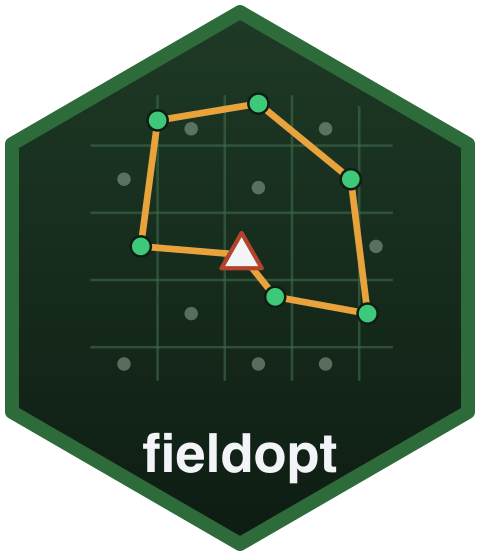
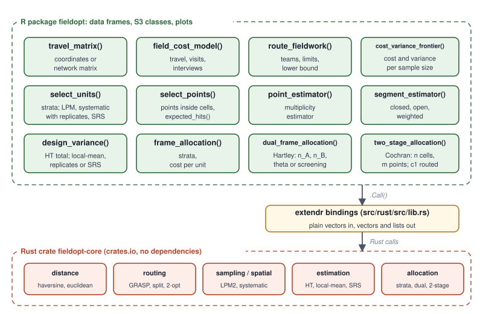
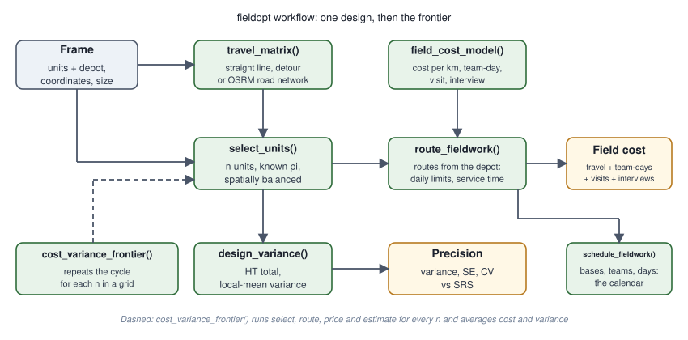

# fieldopt 

<!-- badges: start -->
[](https://github.com/castlaboratory/fieldopt/actions/workflows/R-CMD-check.yaml)
[](https://app.codecov.io/gh/castlaboratory/fieldopt)
[](https://lifecycle.r-lib.org/articles/stages.html#experimental)
<!-- badges: end -->

Area-frame and dual-frame survey design under real field cost. Survey samples
are usually designed for precision alone; the cost that actually decides
whether a survey happens is the field work: travelling between sampling units
and interviewing. `fieldopt` puts that cost next to the variance of the
estimator so that both are visible when the design is chosen, and provides
the pieces an agricultural survey with an area frame (grid cells, points
inside them) and a list frame needs.

- `travel_matrix()` builds the travel matrix between units from coordinates
  (great-circle or planar distances) or wraps a road-network matrix.
- `field_cost_model()` turns travel, visits and interviews into money or time.
- `route_fieldwork()` routes the field work from a depot through the selected
  units, for one team or several, under route-length and stop limits (GRASP
  with 2-opt, Or-opt and an optimal split of the tour), and reports the gap to
  a lower bound.
- `select_units()` draws a probability sample of segments or cells, within
  strata, by the local pivotal method (spatially balanced), by spatially
  ordered systematic sampling along a Hilbert curve with interpenetrating
  replicates, or by simple random sampling.
- `select_points()`, `expected_hits()` and `point_estimator()` implement
  point sampling inside the selected cells and the multiplicity estimator
  (each hit of an establishment counts, divided by its expected hits).
- `segment_estimator()` gives the closed, open and weighted segment
  estimators; `design_variance()` the Horvitz-Thompson total with the
  variance estimator that matches the design (local-mean, replicates, SRS).
- `frame_allocation()` allocates across strata for a target variance or a
  budget; `dual_frame_allocation()` is Hartley's allocation for an area frame
  plus a list frame with overlap, with the optimal mixing weight or the
  screening design; `two_stage_allocation()` is Cochran's two-stage
  allocation with the cost function `c1 n + c2 n m`, where `c1` comes from
  the routing.
- `cost_variance_frontier()` simulates designs over a grid of sample sizes and
  returns the trade-off between field cost and variance.

The numerical engine is the Rust crate
[`fieldopt-core`](https://github.com/castlaboratory/fieldopt-core), usable on
its own from Rust or from other languages.

## Installation

The development version needs a Rust toolchain (`cargo` and `rustc` 1.70 or
later, from <https://rustup.rs>):

```r
# install.packages("pak")
pak::pak("castlaboratory/fieldopt")
```

## Example

```r
library(fieldopt)

set.seed(1)
frame <- data.frame(unit = c("depot", paste0("s", 1:40)),
                    x = c(5, runif(40, 0, 10)), y = c(5, runif(40, 0, 10)))
frame$crop <- c(NA, 20 + 3 * frame$x[-1] + rnorm(40))

model <- field_cost_model(per_travel = 2, per_unit = 30, per_interview = 10,
                          interviews_per_unit = 4, currency = "BRL")

# one design: select, route, price, estimate
units <- frame[frame$unit != "depot", ]
s <- select_units(units, n = 12)
m <- travel_matrix(frame, method = "euclidean")
r <- route_fieldwork(m, units = s$unit[s$sampled], depot = "depot",
                     max_stops = 5, cost_model = model)
r
design_variance(s, y = "crop")

# the frontier across sample sizes
f <- cost_variance_frontier(frame, depot = "depot", cost_model = model,
                            n_grid = c(8, 12, 16, 24), y = "crop",
                            method = "euclidean", max_stops = 5, n_rep = 10)
autoplot(f)
```

## How it works





## Related work

Spatially balanced sampling and its variance estimator follow Grafström,
Lundström and Schelin (2012) and Grafström and Schelin (2014), as implemented
in `BalancedSampling`; the allocations are Cochran's (1977) cost-optimal
allocations and Hartley's (1962, 1974) dual-frame design; the dual-frame
*estimators* (Hartley, Fuller-Burmeister, Kalton-Anderson, pseudo-maximum
likelihood, calibration) are in `Frames2`. What `fieldopt` adds is the
design side with the routing and the cost model, so that the field cost of a
design is computed instead of approximated by the sample size.

## Authors

André Leite (UFPE), Raydonal Ospina (UFBA) and Cristiano Ferraz (UFPE), CAST
Lab. Licence GPL (>= 3).
