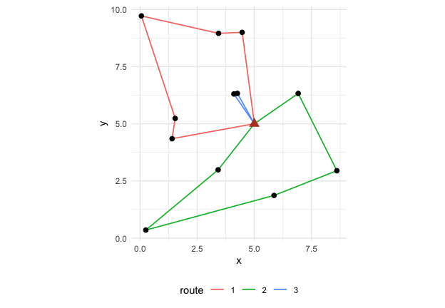
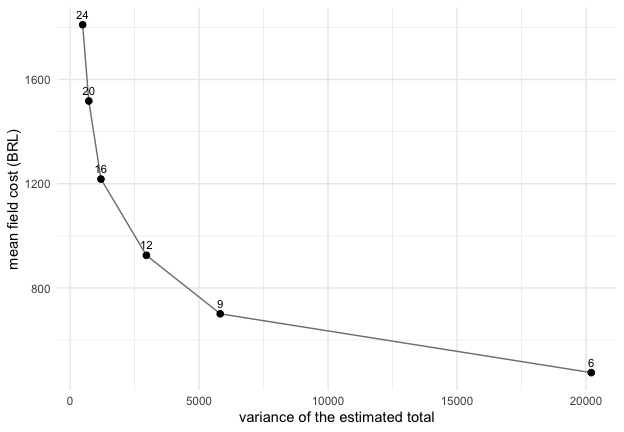

# Get started with fieldopt

A survey that goes to the field has two costs that textbooks keep apart:
the statistical cost, the variance of the estimator for a given sample
size, and the field cost, the travel between units and the interviews,
which is what the budget actually pays for. `fieldopt` puts the two side
by side. This vignette walks through one design from the frame to the
cost-variance frontier.

## A frame with a depot

The frame is a data frame with one row per sampling unit (a segment, a
farm, a census block) and its coordinates. One row is the depot, the
office the teams leave from and return to. Here the frame is synthetic:
forty segments in a 10 x 10 km square, with a crop area that trends from
west to east.

``` r

library(fieldopt)
library(dplyr, warn.conflicts = FALSE)
set.seed(2026)
frame <- tibble(unit = c("depot", paste0("s", 1:40)), x = c(5, runif(40, 0, 10)), y = c(5, runif(40, 0, 10))) |>
  mutate(crop = if_else(unit == "depot", NA_real_, 20 + 3 * x + rnorm(n(), sd = 2)))
frame
#> # A tibble: 41 × 4
#>    unit      x     y  crop
#>    <chr> <dbl> <dbl> <dbl>
#>  1 depot 5     5      NA  
#>  2 s1    6.99  3.71   42.5
#>  3 s2    5.57  8.75   34.3
#>  4 s3    1.40  4.35   24.8
#>  5 s4    2.86  4.40   26.9
#>  6 s5    5.55  0.820  39.5
#>  7 s6    0.251 0.346  22.2
#>  8 s7    4.66  9.29   33.2
#>  9 s8    8.61  2.95   47.4
#> 10 s9    2.53  5.19   28.4
#> # ℹ 31 more rows
```

A real frame usually starts as a spatial object:
[`as_frame()`](https://castlaboratory.github.io/fieldopt/reference/as_frame.md)
turns an `sf` layer of segments or points into this data frame
(centroids in latitude and longitude, the area of each polygon), and
[`as_sf()`](https://castlaboratory.github.io/fieldopt/reference/as_sf.md)
puts samples and results back on the geometries for maps.

## Travel and cost

[`travel_matrix()`](https://castlaboratory.github.io/fieldopt/reference/travel_matrix.md)
computes the matrix of travel distances between all units (or, given a
sample and the depot as `bases`, only between the depot and the sampled
units, which is what the routing needs). With longitude and latitude it
uses great-circle distances in kilometres; with planar coordinates, as
here, Euclidean distances. A matrix computed on a road network (for
example with OSRM) can be passed through the `matrix` argument and is
the better input when it exists.

``` r

m <- travel_matrix(frame, method = "euclidean")
m
#> Travel matrix: 41 units, euclidean (distance); mean off-diagonal 4.886.
```

[`field_cost_model()`](https://castlaboratory.github.io/fieldopt/reference/field_cost_model.md)
turns a routing solution into money: a cost per unit of travel, a fixed
cost per visited unit (access, setting up) and a cost per interview.

``` r

model <- field_cost_model(per_travel = 2, per_unit = 30, per_interview = 10,
                          interviews_per_unit = 4, currency = "BRL")
model
#> Field cost model (BRL): 2 per travel unit, 0 per route, 30 per visited unit, 10
#> per interview.
```

## Select, route, estimate

[`select_units()`](https://castlaboratory.github.io/fieldopt/reference/select_units.md)
draws a spatially balanced probability sample with the local pivotal
method: the inclusion probabilities are known, and units close to each
other are rarely selected together. Spatial balance usually lowers the
variance of totals of spatially structured variables; it also spreads
the units over the territory, which is exactly what makes the field work
longer. Making that tension explicit is the point of the package.

``` r

s <- frame |> filter(unit != "depot") |> select_units(n = 12)
s |> sampled() |> select(unit, x, y, pi)
#> # A tibble: 12 × 4
#>    unit       x     y    pi
#>    <chr>  <dbl> <dbl> <dbl>
#>  1 s3    1.40   4.35    0.3
#>  2 s6    0.251  0.346   0.3
#>  3 s8    8.61   2.95    0.3
#>  4 s11   0.0593 9.72    0.3
#>  5 s12   6.92   6.33    0.3
#>  6 s15   1.54   5.23    0.3
#>  7 s21   3.42   2.98    0.3
#>  8 s22   3.43   8.96    0.3
#>  9 s27   4.11   6.30    0.3
#> 10 s35   5.86   1.86    0.3
#> 11 s36   4.26   6.33    0.3
#> 12 s40   4.47   9.00    0.3
```

[`route_fieldwork()`](https://castlaboratory.github.io/fieldopt/reference/route_fieldwork.md)
routes the field work from the depot through the selected units. Without
limits it returns one tour; with a maximum length or a maximum number of
stops per route, it splits the work into routes, one per team or per
day. Small instances are solved exactly; larger ones by a hybrid genetic
search with an optimal split of the tour and a local search, with a
lower bound and, for single tours, a proof of optimality, so that the
quality of the solution is visible. The sample can be piped straight
into the routing.

``` r

r <- s |>
  travel_matrix(bases = frame |> filter(unit == "depot"), method = "euclidean") |>
  route_fieldwork(units = s, depot = "depot", max_stops = 5, cost_model = model)
r
#> 
#> ── Field routes ────────────────────────────────────────────────────────────────
#> 3 routes from "depot" through 12 units: total travel 42.62 distance (proven
#> optimal).
#> Route 1 (17.81): s3 > s15 > s11 > s22 > s40
#> Route 2 (21.56): s21 > s6 > s35 > s8 > s12
#> Route 3 (3.254): s36 > s27
#> Cost (BRL): travel 85.24 + routes 0 + units 360 + interviews 480 = 925.2.
autoplot(r)
```



Figure of the chunk route

[`design_variance()`](https://castlaboratory.github.io/fieldopt/reference/design_variance.md)
gives the Horvitz-Thompson estimate of the total of `crop` and its
variance by the local-mean estimator of Grafström and Schelin (2014),
which suits spatially balanced samples and needs no joint inclusion
probabilities. The variance the same sample size would give under simple
random sampling is shown for comparison.

``` r

design_variance(s, y = "crop")
#> # A tibble: 1 × 8
#>   total variance    se     cv variance_srs     n     N variance_method
#>   <dbl>    <dbl> <dbl>  <dbl>        <dbl> <int> <int> <chr>          
#> 1 1254.    3158.  56.2 0.0448        5874.    12    40 local-mean
sum(frame$crop, na.rm = TRUE)
#> [1] 1241.484
```

## The cost-variance frontier

A design is chosen by its sample size, its routing limits and its cost
model.
[`cost_variance_frontier()`](https://castlaboratory.github.io/fieldopt/reference/cost_variance_frontier.md)
repeats the select-route-price-estimate cycle for a grid of sample sizes
and returns the mean cost and the mean variance at each size: the
frontier a survey planner faces.

``` r

f <- cost_variance_frontier(frame, depot = "depot", cost_model = model,
                            n_grid = c(6, 9, 12, 16, 20, 24), y = "crop",
                            method = "euclidean", max_stops = 5,
                            n_rep = 8, iterations = 60)
f
#> # A tibble: 6 × 9
#>       n cost_mean cost_sd cost_per_unit travel_mean routes_mean variance_mean
#> * <dbl>     <dbl>   <dbl>         <dbl>       <dbl>       <dbl>         <dbl>
#> 1     6      475.   6.08           79.2        27.6           2        20203.
#> 2     9      701.   4.64           77.9        35.5           2         5820.
#> 3    12      925.   8.47           77.1        42.7           3         2958.
#> 4    16     1218.   6.22           76.1        48.9           4         1198.
#> 5    20     1517.   0.949          75.9        58.7           4          726.
#> 6    24     1810.   3.69           75.4        65.1           5          488.
#> # ℹ 2 more variables: cv_mean <dbl>, n_rep <dbl>
autoplot(f)
```



Figure of the chunk frontier

The frontier makes two questions answerable with numbers: how much the
next unit of precision costs in the field, and how much a different
field organisation (more teams, longer days, a closer depot) would
change that price. The vignettes `routing-teams` and
`frames-and-allocation` take those questions up.

## References

Cochran, W. G. (1977). *Sampling Techniques*, third edition. Wiley.

Grafström, A., Lundström, N. L. P. and Schelin, L. (2012). Spatially
balanced sampling through the pivotal method. *Biometrics*, 68(2),
514–520.

Grafström, A. and Schelin, L. (2014). How to select representative
samples. *Scandinavian Journal of Statistics*, 41(2), 277–290.

Prins, C. (2004). A simple and effective evolutionary algorithm for the
vehicle routing problem. *Computers & Operations Research*, 31(12),
1985–2002.
