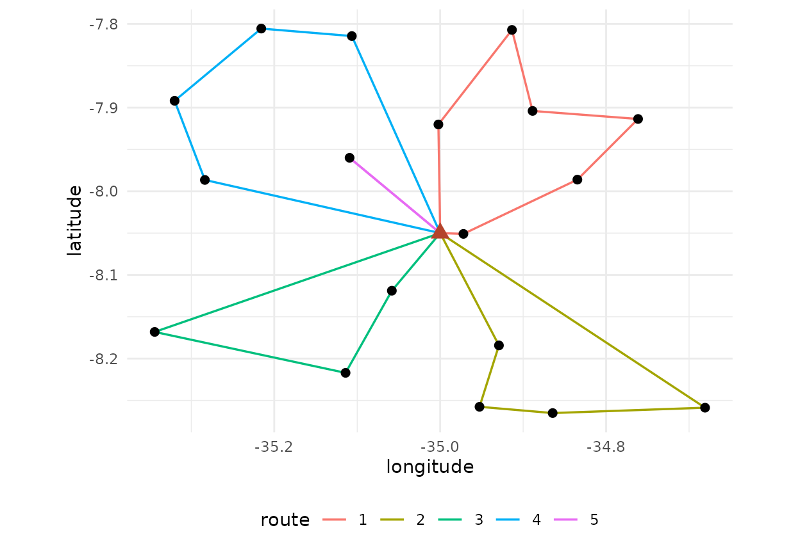
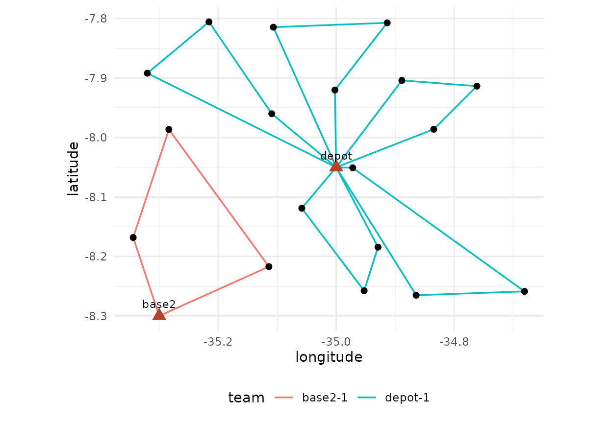

# Routing for one or several teams

The same sample can be worked by one team on a long tour or by several
teams on short routes. The total travel differs, the number of days
differs and the cost differs. This vignette compares those organisations
on one sample.

``` r

library(fieldopt)
set.seed(7)
frame <- data.frame(unit = c("depot", paste0("s", 1:60)),
                    lat = c(-8.05, -8.05 + runif(60, -0.25, 0.25)),
                    lon = c(-35.00, -35.00 + runif(60, -0.35, 0.35)))
m <- travel_matrix(frame)
model <- field_cost_model(per_travel = 1.8, per_unit = 40, per_interview = 12,
                          interviews_per_unit = 6, currency = "BRL")
s <- select_units(frame[-1, ], n = 18, seed = 3)
sel <- s$unit[s$sampled]
```

## One tour

``` r

one <- route_fieldwork(m, units = sel, depot = "depot", cost_model = model)
one
#> 
#> ── Field routes ────────────────────────────────────────────────────────────────
#> 1 route from "depot" through 18 units: total travel 281.1 km (proven optimal).
#> Route 1 (281.1): s30 > s9 > s32 > s27 > s48 > s1 > s29 > s31 > s43 > s19 > s6 >
#> s13 > s54 > s47 > s4 > s16 > s12 > s37
#> Cost (BRL): travel 506 + routes 0 + units 720 + interviews 1296 = 2522.
```

## Routes limited by length

A team that must return to the depot every day has a maximum route
length, here 100 km. The solver splits the tour optimally under that
limit (Prins 2004) and improves each route locally.

``` r

days <- route_fieldwork(m, units = sel, depot = "depot", max_length = 100,
                        cost_model = model)
days
#> 
#> ── Field routes ────────────────────────────────────────────────────────────────
#> 4 routes from "depot" through 18 units: total travel 382 km (lower bound 213.2,
#> gap 79.2%).
#> Route 1 (98.76): s31 > s32 > s9 > s30
#> Route 2 (97.48): s47 > s4 > s16 > s12
#> Route 3 (86.76): s37 > s54 > s13 > s6 > s19 > s43
#> Route 4 (99.02): s27 > s48 > s1 > s29
#> Cost (BRL): travel 687.6 + routes 0 + units 720 + interviews 1296 = 2704.
autoplot(days)
```



## Routes limited by stops

A team that can interview at most four units a day has a stop limit
instead.

``` r

stops <- route_fieldwork(m, units = sel, depot = "depot", max_stops = 4,
                         cost_model = model)
stops
#> 
#> ── Field routes ────────────────────────────────────────────────────────────────
#> 5 routes from "depot" through 18 units: total travel 405.2 km (lower bound
#> 213.2, gap 90.1%).
#> Route 1 (25.21): s37 > s30
#> Route 2 (82.91): s54 > s13 > s19 > s6
#> Route 3 (120.2): s9 > s32 > s27 > s48
#> Route 4 (97.48): s47 > s4 > s16 > s12
#> Route 5 (79.38): s31 > s1 > s29 > s43
#> Cost (BRL): travel 729.4 + routes 0 + units 720 + interviews 1296 = 2745.
```

## Comparing

``` r

data.frame(organisation = c("one tour", "100 km per route", "4 stops per route"),
           routes = c(one$n_routes, days$n_routes, stops$n_routes),
           travel_km = round(c(one$total, days$total, stops$total), 1),
           cost = round(c(one$cost[["total"]], days$cost[["total"]], stops$cost[["total"]])))
#>        organisation routes travel_km cost
#> 1          one tour      1     281.1 2522
#> 2  100 km per route      4     382.0 2704
#> 3 4 stops per route      5     405.2 2745
```

The travel grows with the number of routes because every route starts
and ends at the depot; the question for the planner is whether the extra
kilometres are cheaper than the extra days or teams, which is a cost
model question, not a routing one.

## Road distances

Distances from coordinates understate travel on real roads. Two ways to
do better, both feeding the same routing and cost functions:

- a **detour factor**, the ratio of road to straight-line distance,
  which on rural networks usually lies between 1.2 and 1.4: a planning
  estimate when no network is at hand;
- a **road-network matrix** from an OSRM server, with `method = "osrm"`:
  durations in minutes or distances in kilometres, requested in blocks
  so that the server’s table limit is respected. The public demo server
  is for small tests; run your own server (with OpenStreetMap data of
  the region) for a frame. A matrix computed by any other engine can be
  passed through `matrix` instead.

``` r

m_detour <- travel_matrix(frame, detour = 1.3)
m_detour
#> Travel matrix: 61 units, haversine x 1.3 (km); mean off-diagonal 42.48.
```

``` r

m_road <- travel_matrix(frame, method = "osrm", measure = "duration")
route_fieldwork(m_road, units = sel, depot = "depot", max_length = 480)   # 8 hours per route
```

The `snap` attribute of an OSRM matrix gives the distance from each unit
to the nearest point of the network the server could use; units snapped
from far away are the ones whose access the field team should check.

## Time at the unit, cost per team-day and the calendar

When the matrix is in minutes, a day has a length and so does the work
at each unit: `service_time` is added to the travel of a route when the
limit is checked (a segment with nine points and a few interviews can
take two hours), and the cost model’s `per_route` charges each route as
a team-day (allowances, vehicle, lodging). Routes are then days of work.

``` r

m_min <- travel_matrix(frame, detour = 1.3, unit = "min")   # treat the km as minutes at 60 km/h
daily <- field_cost_model(per_travel = 0.5, per_route = 400, per_unit = 20, per_interview = 15,
                          interviews_per_unit = 3, currency = "BRL")
day <- route_fieldwork(m_min, units = sel, depot = "depot", max_length = 480, service_time = 120,
                       iterations = 50, cost_model = daily)
day
#> 
#> ── Field routes ────────────────────────────────────────────────────────────────
#> 6 routes from "depot" through 18 units: total travel 650.3 min (lower bound
#> 277.2, gap 135%).
#> Route 1 (115.1, duration 475.1): s30 > s9 > s32
#> Route 2 (117.9, duration 477.9): s47 > s4 > s12
#> Route 3 (107, duration 467): s6 > s19 > s13
#> Route 4 (102.8, duration 462.8): s43 > s29 > s1
#> Route 5 (108.4, duration 468.4): s31 > s48 > s27
#> Route 6 (99.3, duration 459.3): s16 > s54 > s37
#> Cost (BRL): travel 325.2 + routes 2400 + units 360 + interviews 810 = 3895.
glance(day)
#> # A tibble: 1 × 9
#>   n_units n_routes total lower_bound   gap optimal longest_route travel_unit
#>     <int>    <int> <dbl>       <dbl> <dbl> <lgl>           <dbl> <chr>      
#> 1      18        6  650.        277.  1.35 FALSE            118. min        
#> # ℹ 1 more variable: cost <dbl>
```

With several teams based in several towns,
[`schedule_fieldwork()`](https://castlaboratory.github.io/fieldopt/reference/schedule_fieldwork.md)
solves one multi-depot problem: which base serves each unit, how the
routes are drawn, and how many routes to open when the cost model
charges a team-day. Each base may send at most `teams * days` routes.
The routes are then distributed over the teams and the days available,
longest first, and the calendar says who goes where on which day and
whether the work fits.

``` r

frame2 <- rbind(frame, data.frame(unit = "base2", lat = -8.30, lon = -35.30))
m2 <- travel_matrix(frame2, detour = 1.3, unit = "min")
sch <- schedule_fieldwork(m2, units = sel, teams = c(depot = 1, base2 = 1), days = 3,
                          max_length = 480, service_time = 120, iterations = 50, cost_model = daily)
sch
#> 
#> ── Field schedule ──────────────────────────────────────────────────────────────
#> 18 units, 2 bases, 2 teams, 3 days available: the work does not fit.
#> "depot": 15 units, 1 team, 5 routes, 5 of 3 days (short of days).
#> "base2": 3 units, 1 team, 1 route, 1 of 3 days.
#> Cost (BRL): 3878.
head(sch$calendar[, c("base", "team", "day", "stops", "travel", "duration")])
#> # A tibble: 6 × 6
#>   base  team      day stops travel duration
#>   <chr> <chr>   <int> <int>  <dbl>    <dbl>
#> 1 base2 base2-1     1     3  118.      478.
#> 2 depot depot-1     1     3  118.      478.
#> 3 depot depot-1     2     3  118.      478.
#> 4 depot depot-1     3     3  104.      464.
#> 5 depot depot-1     4     3   84.9     445.
#> 6 depot depot-1     5     3   71.1     431.
autoplot(sch)
```



## The solver and how good it is

Instances of up to 13 units are solved exactly, by dynamic programming
over subsets (the optimal tour of every subset, then the optimal
partition into feasible routes), and `optimal` is `TRUE`. Larger
instances go to a hybrid genetic search in the spirit of Vidal (2022):
feasible and infeasible subpopulations of giant tours under adaptive
penalties on excess load, duration and stops, order crossover, the
optimal split of Prins (2004), and a local search with granular
neighbourhoods made of 2-opt, Or-opt, relocate, swap, SWAP\* and 2-opt\*
moves, each priced from the route totals in constant time. `iterations`
is the number of offspring; `alpha` the greediness of the constructions
that seed the population.

The `gap` is measured against a lower bound. For a single tour on a
symmetric matrix it is the Held-Karp 1-tree bound, usually within one or
two percent of the optimum, so a small gap means a solution close to
optimal. With several routes the only cheap bound is loose (half the sum
of the cheapest incoming and outgoing edge at each node), and gaps of 50
to 70 percent are normal for solutions that are in fact within one
percent of the optimum; judge those by the benchmark below rather than
by the gap.

``` r

quick <- route_fieldwork(m, units = sel, depot = "depot", iterations = 10, seed = 2)
long <- route_fieldwork(m, units = sel, depot = "depot", iterations = 500, seed = 2)
c(quick = quick$total, long = long$total, bound = long$lower_bound)
#>    quick     long    bound 
#> 281.1368 281.1368 281.1368
```

The solver was run on classical benchmark instances with rounded
Euclidean distances, as the libraries define them (script in the
`fieldopt-core` repository, `examples/benchmark.rs`; one core of a
laptop):

| Set | Instances | Offspring | Optimal | Mean gap | Largest gap | Time per instance |
|----|----|----|----|----|----|----|
| TSPLIB (eil51, berlin52, st70, eil76, rat99, kroA100, eil101) | 7 | 2000 | 7 of 7 | 0.00% | 0.00% | 0.6 to 1.8 s |
| Augerat set A (CVRP, 31 to 79 customers, capacity) | 27 | 2000 | 24 of 27 | 0.01% | 0.15% | 0.7 to 4 s |
| Augerat set A | 27 | 200 (default) | 14 of 27 | 0.20% | 1.14% | under 0.4 s |
| Augerat set A | 27 | `time_limit = 5` | 24 of 27 | 0.01% | 0.15% | 5 s |
| Cordeau multi-depot (p01 to p23: 50 to 360 customers, 2 to 6 depots, route limits per depot, duration limits) | 23 | 2000 | 11 of 23 at or below the best known | 0.29% | 1.5% | 1 to 26 s |

Across eight seeds on four of these instances the gap moved by less than
one percentage point (standard deviation below 0.3 points), so one run
with the default seed is representative. The multi-depot instances are
what
[`schedule_fieldwork()`](https://castlaboratory.github.io/fieldopt/reference/schedule_fieldwork.md)
solves: the base of every route, the routes and how many to open, with a
limit on routes per base.

For field work, with tens of segments per base and daily limits, the
default settings are therefore enough; raise `iterations` to a few
thousand, or give a `time_limit` in seconds, when the instance has
hundreds of units or when a route plan will be used as is.

## The vrpr engine

The `vrpr` package brings the PyVRP solver to R, a production solver
with a much richer local search (SWAP\*, adaptive penalties) and support
for time windows, heterogeneous fleets and multiple depots.
`engine = "vrpr"` sends the same problem to it, with the same inputs and
outputs, except that the limit on a route is either `max_stops` or
`capacity`, there is no lower bound, and the `per_route` cost of a cost
model enters its objective. On the Augerat instances the two engines are
equivalent: both reach 24 of 27 optima within a few seconds (mean gap
0.01% for the built-in solver, 0.05% for vrpr), and both solve the
multi-depot schedule jointly. Prefer vrpr for hundreds of units, for
time windows or for heterogeneous fleets. For a schedule with several
bases, the vrpr engine optimises the assignment of units to bases
jointly with the routes.

``` r

v <- route_fieldwork(m, units = sel, depot = "depot", max_length = 100,
                     cost_model = model, engine = "vrpr", time_limit = 1)
c(fieldopt = days$total, vrpr = v$total)
#> fieldopt     vrpr 
#> 382.0247 382.0247
```
