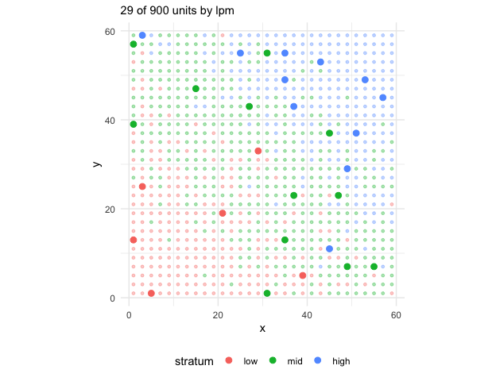

# From the frame to the field: a survey plan end to end

This vignette walks through one agricultural survey from the frame to
the estimate, the way a planning team would: an area frame of cells with
intensity strata and a list frame of large holdings, targets for two
variables, a sample, the field work of several teams from two bases, and
the estimates. Every number is synthetic; the point is the sequence and
what each step hands to the next.


Figure of the chunk unnamed-chunk-2

## 1. The frame

A region of 30 x 30 cells of 2 x 2 km, with an agricultural intensity
that grows from north-west to south-east; the three strata follow it.
Two towns host the field teams. In practice the cells come from
[`read_areaframe()`](https://castlaboratory.github.io/fieldopt/reference/read_areaframe.md)
or
[`as_frame()`](https://castlaboratory.github.io/fieldopt/reference/as_frame.md);
here they are built in place.

``` r

library(fieldopt)
library(dplyr, warn.conflicts = FALSE)
library(tidyr)
set.seed(2027)
cells <- expand_grid(x = seq(1, 59, by = 2), y = seq(1, 59, by = 2)) |>
  mutate(
    unit = paste0("c", row_number()),
    intensity = pmin(1, pmax(0, (x + y) / 120 + rnorm(n(), sd = 0.12))),
    stratum = cut(intensity, c(-1, 0.35, 0.65, 2), labels = c("low", "mid", "high")),
    size = 1 + 2 * intensity, # the size measure: expected farmland
    corn = 40 * intensity * size + rnorm(n(), sd = 4), # planning values
    cattle = 25 * (1 - intensity) * size + rnorm(n(), sd = 5)
  )
bases <- tibble(unit = c("north", "south"), x = c(10, 50), y = c(50, 10))
cells |> count(stratum)
#> # A tibble: 3 × 2
#>   stratum     n
#>   <fct>   <int>
#> 1 low       240
#> 2 mid       412
#> 3 high      248
```

## 2. Targets and allocation

Two study variables with their own precision targets. Cost per cell by
stratum is a planning value; the next vignettes show how to measure it
by routing.
[`multivariate_allocation()`](https://castlaboratory.github.io/fieldopt/reference/multivariate_allocation.md)
finds the cheapest allocation that meets both targets at once.

``` r

strata <- cells |>
  group_by(stratum) |>
  summarise(size = n(), sd_corn = sd(corn), sd_cattle = sd(cattle)) |>
  mutate(cost = c(low = 150, mid = 180, high = 220)[as.character(stratum)])
alloc <- multivariate_allocation(
  strata,
  sd = c("sd_corn", "sd_cattle"), target_cv = c(0.05, 0.08),
  totals = c(sum(cells$corn), sum(cells$cattle))
)
alloc
#> 
#> ── Multivariate allocation ─────────────────────────────────────────────────────
#> Minimum cost 5480 for 2 targets.
#> sd_corn: target 3980000, attained 3797000 (binding).
#> sd_cattle: target 2579000, attained 933100.
#> # A tibble: 3 × 4
#>   stratum  size  cost     n
#>   <fct>   <int> <dbl> <int>
#> 1 low       240   150     6
#> 2 mid       412   180    12
#> 3 high      248   220    11
glance(alloc)
#> # A tibble: 2 × 7
#>   variable    target attained multiplier     n  cost bounded
#>   <chr>        <dbl>    <dbl>      <dbl> <int> <dbl> <lgl>  
#> 1 sd_corn   3979529. 3797176.  0.0012715    29  5480 FALSE  
#> 2 sd_cattle 2579007.  933101.  0            29  5480 FALSE
```

## 3. Selection

A stratified, spatially balanced sample with the allocated sizes, nine
points inside each cell, and the spatial balance as a check.

``` r

n_h <- alloc |>
  select(stratum, n) |>
  tibble::deframe()
s <- cells |> select_units(n = n_h, size = "size", strata = "stratum", seed = 11)
pts <- s |> select_points(points_per_cell = 9, cell_size = 2, layout = "systematic", seed = 3)
tibble(cells = sum(s$sampled), points = nrow(pts), balance = round(spatial_balance(s), 3))
#> # A tibble: 1 × 3
#>   cells points balance
#>   <int>  <int>   <dbl>
#> 1    29    261   0.203
autoplot(s)
```



Figure of the chunk selection

## 4. Field work: routes, teams and days

Each sampled cell takes about three hours (nine points, interviews); a
team-day is eight hours including travel. Two bases, two teams each, and
the calendar says whether the work fits in the campaign.

``` r

money <- field_cost_model(
  per_travel = 1.2, per_route = 600, per_unit = 40, per_interview = 25,
  interviews_per_unit = 3, currency = "BRL"
)
sch <- s |>
  # 40 units per hour: the matrix is in minutes
  travel_matrix(bases = bases, method = "euclidean", detour = 1.3, speed = 40) |>
  schedule_fieldwork(
    units = s, teams = c(north = 2, south = 2), days = 12,
    max_length = 480, service_time = 180, cost_model = money, iterations = 100
  )
sch
#> 
#> ── Field schedule ──────────────────────────────────────────────────────────────
#> 29 units, 2 bases, 4 teams, 12 days available: the work fits.
#> "north": 14 units, 2 teams, 8 routes, 4 of 12 days.
#> "south": 15 units, 2 teams, 9 routes, 5 of 12 days.
#> Cost (BRL): 15680.
glance(sch)
#> # A tibble: 1 × 11
#>   units bases teams routes days_available days_needed fits  travel duration
#>   <int> <int> <dbl>  <int>          <dbl>       <int> <lgl>  <dbl>    <dbl>
#> 1    29     2     4     17             12           5 TRUE  1789.4   7009.4
#> # ℹ 2 more variables: utilisation <dbl>, cost <dbl>
```

``` r

autoplot(sch)
```


Figure of the chunk fieldwork-plot

With the `highs` package the same routes can be redistributed under the
constraints of the campaign, a team away on some days for example
([`schedule_calendar()`](https://castlaboratory.github.io/fieldopt/reference/schedule_calendar.md));
with the `vrpr` package the routing can use the PyVRP solver
(`engine = "vrpr"`).

## 5. The list frame and the overlap

Large holdings are also on a list.
[`frame_overlap()`](https://castlaboratory.github.io/fieldopt/reference/frame_overlap.md)
tells which cells hold listed establishments (to screen them out in the
field, or to mix the two estimates), and
[`dual_frame_allocation()`](https://castlaboratory.github.io/fieldopt/reference/dual_frame_allocation.md)
sizes both samples.

``` r

big <- cells |>
  filter(intensity > 0.8) |>
  slice_sample(n = 60)
list_frame <- big |> transmute(
  unit = paste0("L", row_number()), x = x + runif(n(), -0.9, 0.9),
  y = y + runif(n(), -0.9, 0.9), corn = corn * 1.5
)
ov <- frame_overlap(list_frame, cells, cell_size = 2)
ov$list |> count(domain)
#> # A tibble: 1 × 2
#>   domain     n
#>   <chr>  <int>
#> 1 ab        60
n_overlap <- sum(ov$cells$listed > 0)
domains <- tibble(
  domain = c("a", "ab", "b"),
  size = c(nrow(cells) - n_overlap, n_overlap, 10),
  mean = c(mean(cells$corn), 1.5 * mean(big$corn), 100),
  sd = c(sd(cells$corn), 1.5 * sd(big$corn), 40)
)
cost_a <- glance(sch)$cost / sum(s$sampled)
dual_frame_allocation(domains, cost_a = cost_a, cost_b = 60, target_cv = 0.05)
#> 
#> ── Dual-frame allocation ───────────────────────────────────────────────────────
#> Minimum cost for target variance 5567000: n_A = 101 (frame A, cost 540.8/unit),
#> n_B = 16 (frame B, cost 60/unit), theta = 0.34 (optimised).
#> Cost 55580; variance 5548000 (frame A 5460000, frame B 84000); CV 4.99% of the
#> total 47190.
#> Expected overlap units: 6.7 in the A sample, 13.7 in the B sample.
dual_frame_allocation(
  domains,
  cost_a = cost_a, cost_b = 60, target_cv = 0.05, theta = "screening"
)
#> 
#> ── Dual-frame allocation ───────────────────────────────────────────────────────
#> Minimum cost for target variance 5567000: n_A = 115 (frame A, cost 540.8/unit),
#> n_B = 27 (frame B, cost 60/unit), theta = 0 (fixed).
#> Cost 63810; variance 5527000 (frame A 5430000, frame B 94300); CV 4.98% of the
#> total 47190.
#> Expected overlap units: 7.7 in the A sample, 23.1 in the B sample.
```

## 6. Estimation

After the field work: the cell totals from the points (here simulated),
the design-based total with its variance, and the hand-over to the
`survey` package for calibration and domain estimates.

``` r

field <- s |> mutate(corn_obs = corn * (1 + rnorm(n(), sd = 0.05))) # what the points measured
design_variance(field, "corn_obs") |> select(total, se, cv, variance_method)
#> # A tibble: 1 × 4
#>    total     se       cv variance_method      
#>    <dbl>  <dbl>    <dbl> <chr>                
#> 1 41200. 1838.3 0.044618 stratified local-mean
tibble(true_total = sum(cells$corn))
#> # A tibble: 1 × 1
#>   true_total
#>        <dbl>
#> 1     39898.
if (requireNamespace("survey", quietly = TRUE)) {
  d <- as_svydesign(field)
  survey::svyby(~corn_obs, ~stratum, d, survey::svytotal)
}
#>      stratum  corn_obs        se
#> low      low  2971.308  594.4407
#> mid      mid 17884.983 1254.5027
#> high    high 20343.584 1153.0549
```

## 7. Scaling up

Nothing above depends on the size of the region: the selection runs on a
million cells in seconds, the routing is solved region by region with
`schedule_fieldwork(region = )`, and the travel matrices come from a
road network through `travel_matrix(method = "osrm")` on a server of
your own. The vignette on routing gives the measured times.
