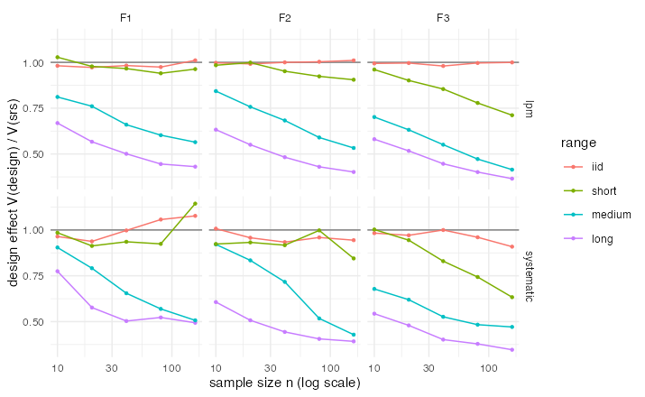
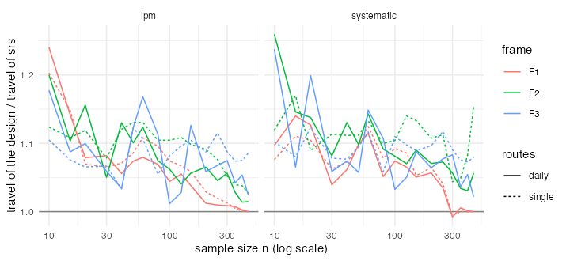
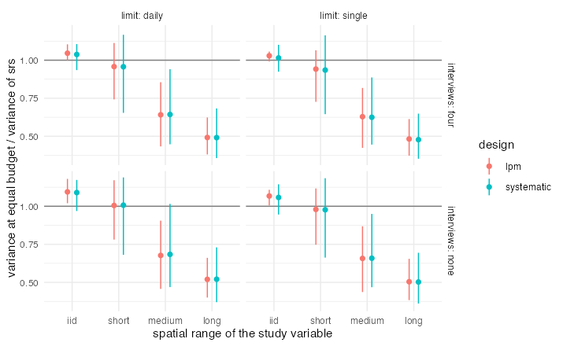

# E1 — the price and the gain of spatial balance

Generated by `experiments/analysis/e1_summary.R` from `experiments/out/e1` (end 2026-10-10 14:33:46 elapsed 12.1 min).

## Question

Spatially balanced designs spread the sample over the frame. When the study variable is spatially
autocorrelated this lowers the variance of the Horvitz-Thompson total; it also lengthens the routes,
because a spread sample has no clumps to visit together. Which effect wins at equal budget, and when?

## Design

- Frames and costs as in E2: F1 a real grid of 448 cells of about 500 km² from the areaframe project,
  F2 a uniform 30 x 30 grid at 10 km, F3 four Gaussian clusters of 900 points in a 300 km square;
  travel in minutes at 60 km/h with detour 1.3; 1.5 per minute, 60 per visited unit, one tour
  (`single`) or daily routes with a fixed 200 per route (`daily`).
- Designs with equal inclusion probabilities n/N: simple random sampling (srs), the local pivotal
  method (lpm) and systematic sampling along a Hilbert curve (systematic).
- Routed cost curves G(n) for each design (10 routed samples per n; lpm and srs reused from E2).
- Design variances of the total by Monte Carlo: 1000 samples per (frame, design, n), n in {10, 20, 40, 80, 160}, the same samples for every field.
- Study variables: Gaussian random fields with exponential covariance, mean 10, sd 3, 20% nugget, range phi = {iid 0, short 0.02, medium 0.1, long 0.3} x sqrt(frame area) (practical range 3 phi; `iid` has no spatial correlation); 20 fields per (frame, range).
- Equal budget: the budget that buys n_srs units under srs (n_srs in {20, 40, 80, 160}), with no
  interviews or with four interviews at 25 each (100 per visited unit); each design gets the n its
  own cost curve allows, and its variance at that n (log-log interpolation). Efficiency is the
  variance of the design over the variance of srs at the same budget: below 1 the design wins.

## Results

### Gain: design effect at equal n (mean over frames)

|design     |range  | n = 10| n = 20| n = 40| n = 80| n = 160|
|:----------|:------|------:|------:|------:|------:|-------:|
|lpm        |iid    |   0.99|   0.99|   0.99|   0.99|    1.01|
|lpm        |short  |   0.99|   0.96|   0.92|   0.88|    0.86|
|lpm        |medium |   0.79|   0.72|   0.63|   0.56|    0.50|
|lpm        |long   |   0.63|   0.54|   0.48|   0.43|    0.40|
|systematic |iid    |   0.98|   0.96|   0.98|   0.99|    0.98|
|systematic |short  |   0.97|   0.93|   0.89|   0.89|    0.87|
|systematic |medium |   0.83|   0.75|   0.63|   0.52|    0.47|
|systematic |long   |   0.64|   0.52|   0.45|   0.44|    0.41|

By frame, at n = 20 and n = 80:

|frame |range  | lpm_20| lpm_80| systematic_20| systematic_80|
|:-----|:------|------:|------:|-------------:|-------------:|
|F1    |iid    |   0.97|   0.97|          0.94|          1.06|
|F1    |short  |   0.98|   0.94|          0.91|          0.92|
|F1    |medium |   0.76|   0.60|          0.79|          0.57|
|F1    |long   |   0.57|   0.45|          0.58|          0.52|
|F2    |iid    |   0.99|   1.00|          0.96|          0.96|
|F2    |short  |   1.00|   0.92|          0.93|          1.00|
|F2    |medium |   0.76|   0.59|          0.83|          0.52|
|F2    |long   |   0.55|   0.43|          0.51|          0.41|
|F3    |iid    |   1.00|   1.00|          0.97|          0.96|
|F3    |short  |   0.90|   0.78|          0.94|          0.74|
|F3    |medium |   0.63|   0.47|          0.62|          0.48|
|F3    |long   |   0.52|   0.40|          0.48|          0.38|

### Price: travel of the design over the travel of srs at equal n

|selection  |frame |limit  | n <= 40| 40 < n <= 150| n > 150|
|:----------|:-----|:------|-------:|-------------:|-------:|
|lpm        |F1    |daily  |    1.12|          1.06|    1.01|
|lpm        |F1    |single |    1.11|          1.08|    1.01|
|lpm        |F2    |daily  |    1.13|          1.08|    1.04|
|lpm        |F2    |single |    1.11|          1.11|    1.05|
|lpm        |F3    |daily  |    1.09|          1.10|    1.05|
|lpm        |F3    |single |    1.07|          1.09|    1.09|
|systematic |F1    |daily  |    1.09|          1.08|    1.02|
|systematic |F1    |single |    1.09|          1.09|    1.02|
|systematic |F2    |daily  |    1.15|          1.10|    1.05|
|systematic |F2    |single |    1.12|          1.12|    1.09|
|systematic |F3    |daily  |    1.13|          1.08|    1.06|
|systematic |F3    |single |    1.09|          1.09|    1.09|

### Equal budget

Mean efficiency over frames and budgets (`worst` is the largest), and the mean ratio of the sample
size the design affords to the srs sample size:

|design     |limit  |interviews |range  | efficiency| worst| n_ratio|
|:----------|:------|:----------|:------|----------:|-----:|-------:|
|lpm        |daily  |four       |iid    |       1.05|  1.10|    0.95|
|lpm        |daily  |four       |short  |       0.96|  1.11|    0.95|
|lpm        |daily  |four       |medium |       0.64|  0.86|    0.95|
|lpm        |daily  |four       |long   |       0.49|  0.62|    0.95|
|lpm        |daily  |none       |iid    |       1.09|  1.18|    0.91|
|lpm        |daily  |none       |short  |       1.01|  1.17|    0.91|
|lpm        |daily  |none       |medium |       0.68|  0.91|    0.91|
|lpm        |daily  |none       |long   |       0.52|  0.66|    0.91|
|lpm        |single |four       |iid    |       1.03|  1.06|    0.97|
|lpm        |single |four       |short  |       0.94|  1.06|    0.97|
|lpm        |single |four       |medium |       0.63|  0.82|    0.97|
|lpm        |single |four       |long   |       0.48|  0.61|    0.97|
|lpm        |single |none       |iid    |       1.07|  1.11|    0.94|
|lpm        |single |none       |short  |       0.98|  1.12|    0.94|
|lpm        |single |none       |medium |       0.66|  0.87|    0.94|
|lpm        |single |none       |long   |       0.50|  0.65|    0.94|
|systematic |daily  |four       |iid    |       1.04|  1.11|    0.94|
|systematic |daily  |four       |short  |       0.96|  1.17|    0.94|
|systematic |daily  |four       |medium |       0.64|  0.94|    0.94|
|systematic |daily  |four       |long   |       0.49|  0.68|    0.94|
|systematic |daily  |none       |iid    |       1.09|  1.17|    0.90|
|systematic |daily  |none       |short  |       1.01|  1.19|    0.90|
|systematic |daily  |none       |medium |       0.68|  1.02|    0.90|
|systematic |daily  |none       |long   |       0.52|  0.73|    0.90|
|systematic |single |four       |iid    |       1.01|  1.10|    0.96|
|systematic |single |four       |short  |       0.94|  1.16|    0.96|
|systematic |single |four       |medium |       0.62|  0.89|    0.96|
|systematic |single |four       |long   |       0.48|  0.65|    0.96|
|systematic |single |none       |iid    |       1.06|  1.14|    0.93|
|systematic |single |none       |short  |       0.98|  1.18|    0.93|
|systematic |single |none       |medium |       0.66|  0.95|    0.93|
|systematic |single |none       |long   |       0.50|  0.69|    0.93|

Share of (frame, route limit, interview cost, budget) cases in which the design beats srs:

|design     |  iid| short| medium| long|
|:----------|----:|-----:|------:|----:|
|lpm        | 0.04|  0.58|   1.00|    1|
|systematic | 0.21|  0.50|   0.98|    1|

Sanity check: the largest Monte Carlo bias of the HT total relative to the total is 0.19% (the designs are unbiased; this is simulation noise).

## What this means for the paper

1. **The price of balance is small.** At equal n, lpm and systematic samples travel 7 to 15% more than
   srs samples when n is small and 1 to 9% more when n is large, far below the 40% of a perfect lattice.
   At equal budget that buys 3 to 10% fewer units (more when travel dominates the cost: no interviews,
   daily routes).
2. **The gain is large whenever the variable is spatially correlated over more than a few cells.** The
   design effect is 0.5 to 0.8 at medium range and 0.4 to 0.6 at long range, and it improves with n.
   With correlation only at the scale of one or two cells (`short`) it is 0.86 to 0.99.
3. **Decision rule.** At equal budget a balanced design wins when its design effect is below the ratio
   of the sample sizes the two designs afford, n_bal / n_srs, which is 0.90 to 0.97 here. With
   medium or long range correlation balance wins in 98 to 100% of the cases and cuts the variance by
   a third to a half; with no correlation it loses 1 to 9% (worst 18%), the cost of the extra travel;
   short range is a coin toss. Both sides of the rule are measured by the package
   (`cost_variance_frontier()` for the costs, a pilot or the previous round for the design effect).
4. **lpm and systematic sampling are interchangeable on these frames**: same price, same gain within
   the Monte Carlo noise. Systematic sampling keeps a simple replicate variance estimator.
5. Together with E2: the routed cost per unit is a third to a fifth of the naive guess, the allocation
   should use the marginal routed cost, and spatial balance is worth its travel for spatially
   structured variables. This is the content of an applied-methods article (cost-aware design of area
   frame surveys) once the literature check of `paper/formulacao.md` section 11 confirms that the
   equal-budget comparison with routed costs has not been published.

Caveats: Gaussian fields with an exponential covariance stand in for real study variables; the real
frame contributes geometry only; equal inclusion probabilities (no size measure); the variance is the
true design variance, not its estimate (the local-mean and replicate estimators are not assessed here).
