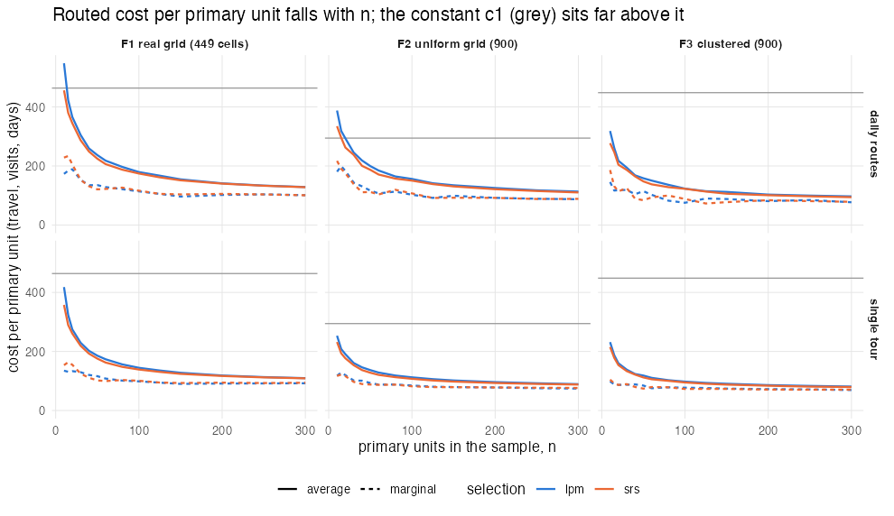
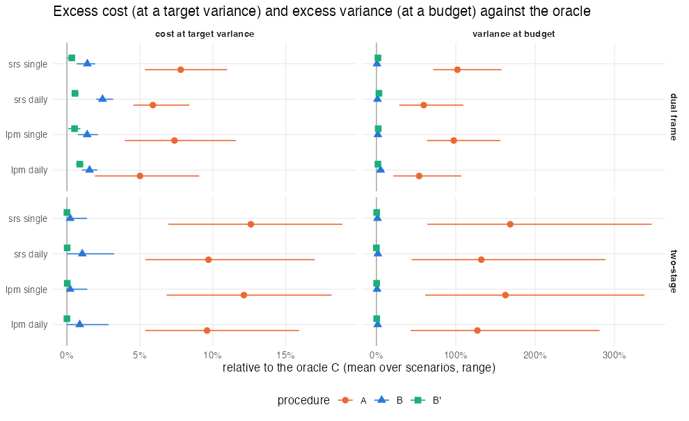
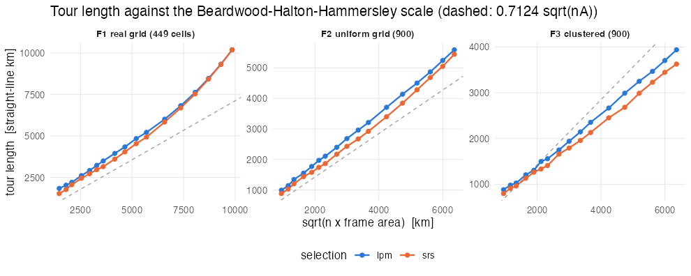

# E2 — allocation with a constant per-unit cost versus the routed cost

Generated by `experiments/analysis/e2_summary.R` from `experiments/out/e2` (R version 4.6.0 (2026-04-24); end 2026-10-10 14:01:59 elapsed 20.7 min).

## Question

Classical allocation treats the cost of a primary unit as a constant c1. In a field survey the
cost of visiting the sampled units is the solution of a routing problem: it depends on how many
units are drawn and how spread out they are, and the cost per unit falls with the sample size.
How wrong are the classical allocations, and does the package's fixed-point loop fix them?

## Design

- Frames: F1 real grid (449 cells); F2 uniform grid (900); F3 clustered (900).
  F1 is a grid of 500 km² cells from the areaframe project with the depot at the cell nearest the
  main town; F2 a 30 x 30 grid at 10 km spacing with the depot at the centre; F3 four Gaussian
  clusters inside a 300 km square with the depot in a corner. Travel in minutes: haversine (F1) or
  euclidean (F2, F3) distance x detour 1.3 at 60 km/h.
- Selection: local pivotal method (lpm, spatially balanced) or simple random sampling (srs).
- Route limits: one tour (`single`) or routes of at most a day of travel (`daily`: 480 min,
  raised to 2.2 x the farthest one-way trip when a cell is otherwise unreachable: F1 1325 min, F2 586 min, F3 1036 min) with a
  fixed cost of 200 per route.
- Cost model: 1.5 per minute of travel, 60 per visited unit, 25 per interview (c2).
- Routed cost curve T(n): `cost_variance_frontier()` on a grid of n with 10 replicate samples per n and
  60 HGS offspring per routing; interpolated by a monotone spline. Every procedure is evaluated with
  the same curve, so the comparison is about the allocation rule, not about routing noise.
- Two-stage (Cochran): M = 20 secondary units per primary unit, S1² = 1, S2²/S1² in {0.5, 2, 8};
  the target variance is the one reached by n = N/5 primary units with m = 5.
- Dual frame (Hartley): domains a / ab / b of sizes N - 0.15N / 0.15N / 30 with means 6 / 30 / 45 and sds 5 / 20 / 35, list cost 45 per unit, target CV 0.08; the area unit costs one interview on top of the routed cost.
- Constraints: a target variance (compare the realised cost) and a budget equal to the oracle's cost
  at that target (compare the realised variance and the real spend against the budget).

Procedures:

- **A, linear**: the classical allocation with the package's default constant c1 = per-unit cost +
  per-minute cost x median one-way trip from the depot (`c1_start` of `two_stage_design()`).
- **B, routed loop**: `two_stage_design()` / `dual_frame_design()`, the fixed-point iteration that
  replaces c1 by the average routed cost T(n)/n at the current n.
- **B', marginal loop**: the same iteration with the marginal cost T'(n) (finite differences on the
  interpolated curve). Under a budget the marginal rule fixes the split (m, or theta and n_b/n_a) and
  the level comes from the true cost curve.
- **C, oracle**: exhaustive search over (n, m) or (n_a, n_b, theta) with the true routed cost curve.

Scenarios: 12 cost curves, 36 two-stage and 12 dual-frame scenarios, each with the two constraints.

## Results

### Two-stage allocation, errors relative to the oracle (mean over S2²/S1² ratios)

|procedure |frame |selection |limit  |n (target) |cost (target) |n (budget) |variance (budget) |spend vs budget |
|:---------|:-----|:---------|:------|:----------|:-------------|:----------|:-----------------|:---------------|
|A         |F1    |lpm       |daily  |-18.0%     |+7.1%         |-55.1%     |+104.6%           |-32.0%          |
|B         |F1    |lpm       |daily  |-8.6%      |+1.1%         |-10.0%     |+2.0%             |-0.2%           |
|B'        |F1    |lpm       |daily  |+0.0%      |+0.0%         |+4.9%      |+0.7%             |-0.3%           |
|A         |F1    |lpm       |single |-18.0%     |+9.1%         |-61.8%     |+139.4%           |-37.9%          |
|B         |F1    |lpm       |single |-3.7%      |+0.5%         |-6.8%      |+1.6%             |-0.2%           |
|B'        |F1    |lpm       |single |+6.8%      |+0.1%         |+8.7%      |+0.7%             |-0.5%           |
|A         |F1    |srs       |daily  |-18.0%     |+7.3%         |-56.3%     |+110.3%           |-33.6%          |
|B         |F1    |srs       |daily  |-8.6%      |+1.3%         |-10.6%     |+2.8%             |-0.6%           |
|B'        |F1    |srs       |daily  |+0.0%      |+0.0%         |+0.0%      |+0.0%             |+0.0%           |
|A         |F1    |srs       |single |-19.9%     |+9.6%         |-63.5%     |+147.2%           |-39.4%          |
|B         |F1    |srs       |single |-6.2%      |+0.5%         |-7.9%      |+2.7%             |-1.1%           |
|B'        |F1    |srs       |single |+0.0%      |+0.0%         |+9.0%      |+0.8%             |-0.5%           |
|A         |F2    |lpm       |daily  |-20.0%     |+7.5%         |-50.7%     |+86.0%            |-32.3%          |
|B         |F2    |lpm       |daily  |-7.8%      |+0.9%         |-10.7%     |+1.2%             |+0.4%           |
|B'        |F2    |lpm       |daily  |+0.0%      |+0.0%         |+0.0%      |+0.0%             |+0.0%           |
|A         |F2    |lpm       |single |-22.2%     |+10.1%        |-60.4%     |+121.7%           |-40.7%          |
|B         |F2    |lpm       |single |-2.8%      |+0.2%         |-3.2%      |+0.5%             |-0.2%           |
|B'        |F2    |lpm       |single |+0.0%      |+0.0%         |+3.5%      |+0.1%             |-0.1%           |
|A         |F2    |srs       |daily  |-22.2%     |+7.3%         |-53.9%     |+89.4%            |-33.2%          |
|B         |F2    |srs       |daily  |-10.4%     |+0.8%         |-11.6%     |+1.6%             |-0.4%           |
|B'        |F2    |srs       |daily  |+0.0%      |+0.0%         |+0.0%      |+0.0%             |+0.0%           |
|A         |F2    |srs       |single |-22.2%     |+10.3%        |-61.0%     |+126.0%           |-41.9%          |
|B         |F2    |srs       |single |-2.8%      |+0.2%         |-0.5%      |+0.6%             |-0.5%           |
|B'        |F2    |srs       |single |+0.0%      |+0.0%         |+3.5%      |+0.1%             |-0.1%           |
|A         |F3    |lpm       |daily  |-24.9%     |+14.2%        |-70.7%     |+191.2%           |-45.8%          |
|B         |F3    |lpm       |daily  |-5.5%      |+0.6%         |-3.9%      |+1.7%             |-0.7%           |
|B'        |F3    |lpm       |daily  |+0.0%      |+0.0%         |+6.6%      |+0.3%             |-0.1%           |
|A         |F3    |lpm       |single |-26.8%     |+17.1%        |-73.5%     |+226.7%           |-53.2%          |
|B         |F3    |lpm       |single |+0.0%      |+0.0%         |-0.3%      |+0.3%             |-0.3%           |
|B'        |F3    |lpm       |single |+0.0%      |+0.0%         |+3.5%      |+0.1%             |-0.2%           |
|A         |F3    |srs       |daily  |-26.8%     |+14.5%        |-71.5%     |+196.6%           |-48.3%          |
|B         |F3    |srs       |daily  |-8.3%      |+1.1%         |-9.3%      |+1.3%             |+0.1%           |
|B'        |F3    |srs       |daily  |+3.7%      |+0.0%         |+0.0%      |+0.0%             |+0.0%           |
|A         |F3    |srs       |single |-29.0%     |+17.9%        |-75.5%     |+232.7%           |-53.1%          |
|B         |F3    |srs       |single |-3.4%      |+0.0%         |-4.0%      |+0.9%             |-0.6%           |
|B'        |F3    |srs       |single |+0.0%      |+0.0%         |+0.0%      |+0.0%             |+0.0%           |

By variance structure (mean over frames, selections and limits):

|procedure |s2_ratio    |n (target) |cost (target) |n (budget) |variance (budget) |spend vs budget |
|:---------|:-----------|:----------|:-------------|:----------|:-----------------|:---------------|
|A         |S2/S1 = 0.5 |-17.1%     |+10.6%        |-68.0%     |+216.1%           |-49.8%          |
|B         |S2/S1 = 0.5 |-5.5%      |+0.6%         |-6.7%      |+1.4%             |-0.5%           |
|B'        |S2/S1 = 0.5 |+1.7%      |+0.0%         |+3.2%      |+0.2%             |-0.1%           |
|A         |S2/S1 = 2   |-19.8%     |+11.0%        |-63.9%     |+153.5%           |-44.1%          |
|B         |S2/S1 = 2   |-3.7%      |+0.3%         |-4.7%      |+1.5%             |-0.6%           |
|B'        |S2/S1 = 2   |+0.0%      |+0.0%         |+0.0%      |+0.0%             |+0.0%           |
|A         |S2/S1 = 8   |-30.1%     |+11.4%        |-56.6%     |+73.4%            |-28.9%          |
|B         |S2/S1 = 8   |-7.8%      |+0.9%         |-8.4%      |+1.4%             |+0.0%           |
|B'        |S2/S1 = 8   |+0.9%      |+0.0%         |+6.7%      |+0.6%             |-0.4%           |

Overall:

|procedure |n (target) |cost (target) |n (budget) |variance (budget) |spend vs budget |
|:---------|:----------|:-------------|:----------|:-----------------|:---------------|
|A         |-22.3%     |+11.0%        |-62.8%     |+147.7%           |-41.0%          |
|B         |-5.7%      |+0.6%         |-6.6%      |+1.4%             |-0.4%           |
|B'        |+0.9%      |+0.0%         |+3.3%      |+0.2%             |-0.2%           |

### Dual-frame allocation, errors relative to the oracle

|procedure |frame |selection |limit  |n (target) |cost (target) |n (budget) |variance (budget) |spend vs budget |
|:---------|:-----|:---------|:------|:----------|:-------------|:----------|:-----------------|:---------------|
|A         |F1    |lpm       |daily  |-11.5%     |+4.0%         |-30.8%     |+33.4%            |-12.0%          |
|B         |F1    |lpm       |daily  |-7.7%      |+2.1%         |-19.2%     |+9.8%             |-2.7%           |
|B'        |F1    |lpm       |daily  |+0.0%      |+1.1%         |+0.0%      |+2.8%             |-1.1%           |
|A         |F1    |lpm       |single |-14.8%     |+6.6%         |-48.1%     |+72.2%            |-18.6%          |
|B         |F1    |lpm       |single |-7.4%      |+2.1%         |-11.1%     |+2.6%             |-0.5%           |
|B'        |F1    |lpm       |single |+0.0%      |+0.9%         |-3.7%      |+4.2%             |-2.2%           |
|A         |F1    |srs       |daily  |-11.5%     |+4.7%         |-34.6%     |+40.7%            |-15.0%          |
|B         |F1    |srs       |daily  |-7.7%      |+2.1%         |-11.5%     |-0.5%             |+2.4%           |
|B'        |F1    |srs       |daily  |+0.0%      |+0.4%         |+0.0%      |+4.4%             |-2.0%           |
|A         |F1    |srs       |single |-14.8%     |+7.1%         |-48.1%     |+77.2%            |-24.7%          |
|B         |F1    |srs       |single |-7.4%      |+1.9%         |-11.1%     |+0.6%             |+1.2%           |
|B'        |F1    |srs       |single |+0.0%      |+0.5%         |+0.0%      |+1.0%             |-0.5%           |
|A         |F2    |lpm       |daily  |-8.3%      |+1.9%         |-22.2%     |+21.3%            |-10.1%          |
|B         |F2    |lpm       |daily  |-5.6%      |+1.0%         |-8.3%      |+1.4%             |+0.4%           |
|B'        |F2    |lpm       |daily  |+2.8%      |+0.6%         |+2.8%      |+1.0%             |-0.5%           |
|A         |F2    |lpm       |single |-15.4%     |+4.0%         |-46.2%     |+63.8%            |-25.0%          |
|B         |F2    |lpm       |single |-7.7%      |+0.8%         |-10.3%     |+0.6%             |+0.3%           |
|B'        |F2    |lpm       |single |-2.6%      |+0.1%         |-5.1%      |+1.7%             |-1.3%           |
|A         |F2    |srs       |daily  |-15.4%     |+4.6%         |-33.3%     |+28.8%            |-10.9%          |
|B         |F2    |srs       |daily  |-10.3%     |+3.2%         |-15.4%     |+2.7%             |+1.7%           |
|B'        |F2    |srs       |daily  |+0.0%      |+0.8%         |-7.7%      |+3.2%             |-1.2%           |
|A         |F2    |srs       |single |-15.4%     |+5.3%         |-48.7%     |+71.5%            |-27.2%          |
|B         |F2    |srs       |single |-5.1%      |+1.6%         |-7.7%      |+0.6%             |+0.3%           |
|B'        |F2    |srs       |single |+0.0%      |+0.5%         |-5.1%      |+3.2%             |-2.0%           |
|A         |F3    |lpm       |daily  |-17.9%     |+9.1%         |-59.0%     |+106.9%           |-32.1%          |
|B         |F3    |lpm       |daily  |-10.3%     |+1.5%         |-15.4%     |+4.6%             |-0.2%           |
|B'        |F3    |lpm       |daily  |+0.0%      |+0.9%         |-7.7%      |+1.8%             |-0.6%           |
|A         |F3    |lpm       |single |-17.9%     |+11.6%        |-66.7%     |+156.4%           |-39.8%          |
|B         |F3    |lpm       |single |-5.1%      |+1.3%         |-10.3%     |+2.4%             |-0.1%           |
|B'        |F3    |lpm       |single |+0.0%      |+0.6%         |-5.1%      |+1.0%             |-0.4%           |
|A         |F3    |srs       |daily  |-17.9%     |+8.4%         |-59.0%     |+109.5%           |-34.7%          |
|B         |F3    |srs       |daily  |-7.7%      |+2.0%         |-12.8%     |+2.0%             |+0.5%           |
|B'        |F3    |srs       |daily  |+0.0%      |+0.5%         |-2.6%      |+1.9%             |-1.2%           |
|A         |F3    |srs       |single |-17.9%     |+11.0%        |-66.7%     |+157.6%           |-41.5%          |
|B         |F3    |srs       |single |-5.1%      |+0.7%         |-7.7%      |+1.2%             |-0.1%           |
|B'        |F3    |srs       |single |+0.0%      |+0.0%         |+0.0%      |+1.6%             |-1.1%           |

Overall:

|procedure |n (target) |cost (target) |n (budget) |variance (budget) |spend vs budget |
|:---------|:----------|:-------------|:----------|:-----------------|:---------------|
|A         |-14.9%     |+6.5%         |-46.9%     |+78.3%            |-24.3%          |
|B         |-7.3%      |+1.7%         |-11.7%     |+2.3%             |+0.3%           |
|B'        |+0.0%      |+0.6%         |-2.9%      |+2.3%             |-1.2%           |

### Worst cases

|problem    |procedure |max cost (target) |max variance (budget) |min spend vs budget |
|:----------|:---------|:-----------------|:---------------------|:-------------------|
|dual_frame |A         |+11.6%            |+157.6%               |-41.5%              |
|dual_frame |B         |+3.2%             |+9.8%                 |-2.7%               |
|dual_frame |B'        |+1.1%             |+4.4%                 |-2.2%               |
|two_stage  |A         |+18.9%            |+346.9%               |-64.3%              |
|two_stage  |B         |+3.2%             |+4.3%                 |-1.3%               |
|two_stage  |B'        |+0.2%             |+2.2%                 |-1.2%               |

`spend vs budget` is the real cost of the design relative to the budget the procedure believed it was
spending: a negative value means the survey came in under budget because the assumed cost per unit was
too high, with the variance that goes with the smaller sample.

### Side results

Routed cost per unit at the oracle's n, relative to the constant c1 used by A:

|frame |selection |limit  | n_C|c1 routed / c1 naive |
|:-----|:---------|:------|---:|:--------------------|
|F1    |lpm       |daily  |  91|0.41                 |
|F1    |lpm       |single |  91|0.33                 |
|F1    |srs       |daily  |  91|0.39                 |
|F1    |srs       |single |  93|0.31                 |
|F2    |lpm       |daily  | 198|0.43                 |
|F2    |lpm       |single | 202|0.33                 |
|F2    |srs       |daily  | 202|0.42                 |
|F2    |srs       |single | 202|0.32                 |
|F3    |lpm       |daily  | 198|0.23                 |
|F3    |lpm       |single | 202|0.19                 |
|F3    |srs       |daily  | 202|0.23                 |
|F3    |srs       |single | 208|0.19                 |

Travel law. Exponent b of log travel = a + b log n (n >= 20) and, for single tours, the constant beta of
travel = beta sqrt(n A) in straight-line km (Beardwood-Halton-Hammersley: 0.7124 for uniform random
points, about 1 for a regular lattice). A is the frame area (sum of the cells for F1, the square for F2,
the bounding box for F3).

|frame |selection |limit  |exponent b |beta (km / sqrt(nA)) |
|:-----|:---------|:------|:----------|:--------------------|
|F1    |lpm       |daily  |0.465      |NA                   |
|F1    |lpm       |single |0.484      |0.970                |
|F1    |srs       |daily  |0.494      |NA                   |
|F1    |srs       |single |0.513      |0.947                |
|F2    |lpm       |daily  |0.462      |NA                   |
|F2    |lpm       |single |0.463      |0.879                |
|F2    |srs       |daily  |0.495      |NA                   |
|F2    |srs       |single |0.489      |0.828                |
|F3    |lpm       |daily  |0.454      |NA                   |
|F3    |lpm       |single |0.437      |0.632                |
|F3    |srs       |daily  |0.469      |NA                   |
|F3    |srs       |single |0.431      |0.582                |

Spatial balance and travel: ratio of the routed travel of lpm to srs samples at equal n.

|frame |limit  |n range |travel lpm / srs (mean) |at n <= 60 |at n >= 150 |
|:-----|:------|:-------|:-----------------------|:----------|:-----------|
|F1    |daily  |10-448  |1.06                    |1.11       |1.01        |
|F1    |single |10-448  |1.07                    |1.11       |1.02        |
|F2    |daily  |10-450  |1.08                    |1.12       |1.04        |
|F2    |single |10-450  |1.09                    |1.12       |1.06        |
|F3    |daily  |10-450  |1.08                    |1.11       |1.06        |
|F3    |single |10-450  |1.08                    |1.08       |1.09        |

## What this means for the paper

1. **The constant-cost allocation is wrong by a wide margin.** The default c1 (median trip from the
   depot) is 2.5 to 5 times the routed cost per unit at the optimum, because a tour shares the travel
   among the units it visits. At a target variance the classical two-stage design costs 7 to 18%
   more than necessary (dual frame: 2 to 12%); under a budget it takes 50 to 75% fewer primary units
   than it could afford, comes in 25 to 65% under budget and delivers 60 to 350% more variance. The
   error grows with the clustering of the frame (F3) and with S2²/S1².
2. **The fixed-point loop on the average routed cost (the package's `two_stage_design()` and
   `dual_frame_design()`) removes most of it** but keeps a bias of the predicted sign: with T(n)
   concave the average cost exceeds the marginal cost, so the loop takes 3 to 12% too few primary
   units; the loss is small at a target variance (0 to 3% extra cost) and under a budget (0 to 10%
   extra variance, mostly below 3%).
3. **The marginal-cost loop closes the gap**: excess cost at most 0.2% (two-stage) and 1.1% (dual
   frame), excess variance at most 2 to 4%. This is the result to carry into the paper: Cochran's
   m* = sqrt(c1 S2² / (c2 S1²)) holds with c1 replaced by the marginal routed cost G'(n), and under
   a budget the level of n must come from the true cost curve, not from the linearised one.
4. **The travel law is Beardwood-Halton-Hammersley in every frame**, also with daily routes: the
   exponent of n is 0.43 to 0.51 and, for single tours, beta is 0.95 on the real grid and 0.83 to 0.88
   on the uniform grid (above the 0.71 of random points because the depot sits on the tour and the
   samples are regular); on the clustered frame beta falls to 0.6 only because the bounding box
   overstates the occupied area. So G(n) = a n + beta sqrt(n A) + c is a usable closed form for the
   formulation, with G'(n) = a + beta sqrt(A) / (2 sqrt(n)).
5. **Spatial balance is cheap in travel**: lpm tours are 6 to 9% longer than srs tours on average,
   11% at n <= 60 and 1 to 6% at n >= 150. The variance gain of spatial balance (not measured here,
   E1) has to be weighed against this, but the price is far below the 40% that a perfect lattice
   would suggest.

Caveats: planning values are the truth here (no sampling of y); the real frame is one grid of large
cells; the dual-frame scenarios have a small area sample (n_a about 26 to 39) because the list frame
is cheap, so their relative errors are coarser; the marginal loop did not converge in a few scenarios
(it cycled between two n) and was stopped at the last iterate.
