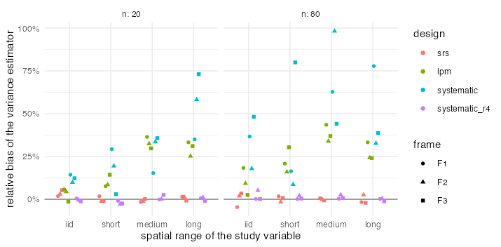

# E3 — bias and coverage of the variance estimators

Generated by `experiments/analysis/e3_summary.R` from `experiments/out/e3` (end 2026-10-10 16:03:53 elapsed 1.8 min).

## Question

E1 compared designs by their true variance. In a survey only the estimate is available, so the
comparison is usable only if `design_variance()` estimates the variance well under each design.

## Design

- Frames F1 (real 448-cell grid), F2 (uniform grid), F3 (clustered) of E1/E2.
- Designs: srs (simple random sampling formula), lpm (local-mean estimator of Grafström and Schelin),
  systematic along a Hilbert curve in one replicate (local-mean estimator, the customary approximation)
  and in four interpenetrating replicates (between-replicate estimator, 3 degrees of freedom).
- n in {20, 80}; 1000 samples per (frame, design, n); 5 fields of E1 per spatial range (iid, short, medium, long).
- Relative bias = mean of the variance estimates / empirical variance of the HT totals - 1; coverage of
  the 95% interval with the t quantile on the `df` that `design_variance()` reports (3 for four
  replicates; n - 1 otherwise, practically normal).

## Results

Mean over frames and fields:

|design        |method     |range  |rel_bias (n = 20) |rel_bias (n = 80) |coverage (n = 20) |coverage (n = 80) |
|:-------------|:----------|:------|:-----------------|:-----------------|:-----------------|:-----------------|
|srs           |srs        |iid    |+3%               |+0%               |0.953             |0.949             |
|srs           |srs        |short  |-0%               |+0%               |0.950             |0.951             |
|srs           |srs        |medium |-1%               |-0%               |0.948             |0.949             |
|srs           |srs        |long   |+1%               |-0%               |0.950             |0.950             |
|lpm           |local-mean |iid    |+3%               |+10%              |0.949             |0.958             |
|lpm           |local-mean |short  |+10%              |+22%              |0.954             |0.966             |
|lpm           |local-mean |medium |+33%              |+38%              |0.970             |0.977             |
|lpm           |local-mean |long   |+30%              |+27%              |0.971             |0.970             |
|systematic    |local-mean |iid    |+12%              |+34%              |0.955             |0.961             |
|systematic    |local-mean |short  |+17%              |+35%              |0.952             |0.956             |
|systematic    |local-mean |medium |+28%              |+68%              |0.963             |0.979             |
|systematic    |local-mean |long   |+55%              |+50%              |0.986             |0.982             |
|systematic_r4 |replicates |iid    |-0%               |+2%               |0.947             |0.947             |
|systematic_r4 |replicates |short  |-2%               |+1%               |0.950             |0.942             |
|systematic_r4 |replicates |medium |+1%               |+1%               |0.945             |0.942             |
|systematic_r4 |replicates |long   |+0%               |-0%               |0.947             |0.947             |

Relative bias by frame (mean over n):

|frame |range  |srs |lpm  |systematic |systematic_r4 |
|:-----|:------|:---|:----|:----------|:-------------|
|F1    |iid    |-1% |+12% |+25%       |+0%           |
|F1    |short  |+2% |+14% |+23%       |-0%           |
|F1    |medium |-0% |+40% |+39%       |+0%           |
|F1    |long   |-0% |+33% |+56%       |+0%           |
|F2    |iid    |+2% |+7%  |+14%       |+2%           |
|F2    |short  |-1% |+12% |+14%       |-0%           |
|F2    |medium |-1% |+33% |+66%       |+1%           |
|F2    |long   |+2% |+25% |+45%       |+1%           |
|F3    |iid    |+4% |+1%  |+30%       |-1%           |
|F3    |short  |-0% |+22% |+41%       |-1%           |
|F3    |medium |-0% |+33% |+40%       |+2%           |
|F3    |long   |-1% |+28% |+56%       |-1%           |

## What this means

1. **srs and replicates are unbiased** in every scenario. With four replicates the variance has 3
   degrees of freedom: the normal interval covers only 0.85, the t interval 0.95.
2. **The local-mean estimator is conservative when the variable is spatially smooth** and close to
   unbiased when it is not, as expected from its construction (the local mean removes only the trend
   inside each neighbourhood). Under lpm the overestimate at medium and long range is about a third;
   intervals over-cover (0.96 to 0.98). A comparison of designs by their *estimated* variance is
   therefore biased against lpm and single-replicate systematic samples by roughly that much; E1 used
   the true variance and is not affected.
3. **Before the fix of fieldopt-core 0.10.0** the neighbourhood grew until the inclusion probabilities
   summed to one (about N/n units) and the overestimate reached +60 to +160% on smooth fields
   (`experiments/out/e3_before_fix`). The estimator now matches `BalancedSampling::vsb()` with k = 3.
4. For single-replicate systematic samples no design-unbiased estimator exists; the local-mean
   approximation is conservative here by 12 to 68%. Interpenetrating replicates cost nothing in
   travel and give an unbiased estimate: they are the recommended default for systematic designs.
