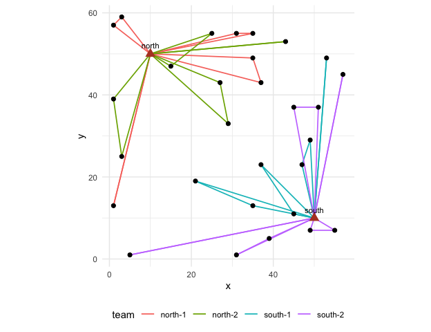

<!-- Generated from survey-plan.Rmd.orig by tools/precompute-vignettes.R; edit the .orig file. -->


This vignette walks through one agricultural survey from the frame to the
estimate, the way a planning team would: an area frame of cells with
intensity strata and a list frame of large holdings, targets for two
variables, a sample, the field work of several teams from two bases, and the
estimates. Every number is synthetic; the point is the sequence and what
each step hands to the next.

<div class="figure">

<p class="caption">Figure of the chunk unnamed-chunk-2</p>
</div>

## 1. The frame

A region of 30 x 30 cells of 2 x 2 km, with an agricultural intensity that
grows from north-west to south-east; the three strata follow it. Two towns
host the field teams. In practice the cells come from `read_areaframe()` or
`as_frame()`; here they are built in place.


``` r
library(fieldopt)
set.seed(2027)
cells <- expand.grid(x = seq(1, 59, by = 2), y = seq(1, 59, by = 2))
cells$unit <- paste0("c", seq_len(nrow(cells)))
cells$intensity <- pmin(1, pmax(0, (cells$x + cells$y) / 120 + rnorm(nrow(cells), sd = 0.12)))
cells$stratum <- cut(cells$intensity, c(-1, 0.35, 0.65, 2), labels = c("low", "mid", "high"))
cells$size <- 1 + 2 * cells$intensity            # the size measure: expected farmland
cells$corn <- 40 * cells$intensity * cells$size + rnorm(nrow(cells), sd = 4)   # planning values
cells$cattle <- 25 * (1 - cells$intensity) * cells$size + rnorm(nrow(cells), sd = 5)
bases <- data.frame(unit = c("north", "south"), x = c(10, 50), y = c(50, 10))
table(cells$stratum)
#> 
#>  low  mid high 
#>  240  412  248
```

## 2. Targets and allocation

Two study variables with their own precision targets. Cost per cell by
stratum is a planning value; the next vignettes show how to measure it by
routing. `multivariate_allocation()` finds the cheapest allocation that meets
both targets at once.


``` r
strata <- do.call(rbind, lapply(split(cells, cells$stratum), function(d) data.frame(
  stratum = as.character(d$stratum[1]), size = nrow(d), cost = c(low = 150, mid = 180, high = 220)[as.character(d$stratum[1])],
  sd_corn = sd(d$corn), sd_cattle = sd(d$cattle))))
alloc <- multivariate_allocation(strata, sd = c("sd_corn", "sd_cattle"), target_cv = c(0.05, 0.08),
                                 totals = c(sum(cells$corn), sum(cells$cattle)))
alloc
#> 
#> ── Multivariate allocation ─────────────────────────────────────────────────────
#> Minimum cost 5480 for 2 targets.
#> sd_corn: target 3980000, attained 3797000 (binding).
#> sd_cattle: target 2579000, attained 933100.
#> # A tibble: 3 × 4
#>   stratum  size  cost     n
#>   <chr>   <int> <dbl> <int>
#> 1 low       240   150     6
#> 2 mid       412   180    12
#> 3 high      248   220    11
glance(alloc)
#> # A tibble: 2 × 7
#>   variable    target attained multiplier     n  cost bounded
#>   <chr>        <dbl>    <dbl>      <dbl> <int> <dbl> <lgl>  
#> 1 sd_corn   3979529. 3797176.    0.00127    29  5480 FALSE  
#> 2 sd_cattle 2579007.  933101.    0          29  5480 FALSE
```

## 3. Selection

A stratified, spatially balanced sample with the allocated sizes, nine
points inside each cell, and the spatial balance as a check.


``` r
n_h <- stats::setNames(alloc$n, alloc$stratum)
s <- select_units(cells, n = n_h, size = "size", strata = "stratum", seed = 11)
pts <- select_points(s, points_per_cell = 9, cell_size = 2, layout = "systematic", seed = 3)
c(cells = sum(s$sampled), points = nrow(pts), balance = round(spatial_balance(s), 3))
#>   cells  points balance 
#>  29.000 261.000   0.203
autoplot(s)
```


## 4. Field work: routes, teams and days

Each sampled cell takes about three hours (nine points, interviews); a
team-day is eight hours including travel. Two bases, two teams each, and the
calendar says whether the work fits in the campaign.


``` r
money <- field_cost_model(per_travel = 1.2, per_route = 600, per_unit = 40, per_interview = 25,
                          interviews_per_unit = 3, currency = "BRL")
sch <- s |>
  travel_matrix(bases = bases, method = "euclidean", detour = 1.3, speed = 40) |>   # 40 units/h: minutes
  schedule_fieldwork(units = s, teams = c(north = 2, south = 2), days = 12,
                     max_length = 480, service_time = 180, cost_model = money, iterations = 100)
sch
#> 
#> ── Field schedule ──────────────────────────────────────────────────────────────
#> 29 units, 2 bases, 4 teams, 12 days available: the work fits.
#> "north": 15 units, 2 teams, 9 routes, 5 of 12 days.
#> "south": 14 units, 2 teams, 8 routes, 4 of 12 days.
#> Cost (BRL): 15680.
glance(sch)
#> # A tibble: 1 × 11
#>   units bases teams routes days_available days_needed fits  travel duration
#>   <int> <int> <dbl>  <int>          <dbl>       <int> <lgl>  <dbl>    <dbl>
#> 1    29     2     4     17             12           5 TRUE   1789.    7009.
#> # ℹ 2 more variables: utilisation <dbl>, cost <dbl>
```


``` r
autoplot(sch)
```



With the `highs` package the same routes can be redistributed under the
constraints of the campaign, a team away on some days for example
(`schedule_calendar()`); with the `vrpr` package the routing can use the
PyVRP solver (`engine = "vrpr"`).

## 5. The list frame and the overlap

Large holdings are also on a list. `frame_overlap()` tells which cells hold
listed establishments (to screen them out in the field, or to mix the two
estimates), and `dual_frame_allocation()` sizes both samples.


``` r
big <- cells[cells$intensity > 0.8, ][sample.int(sum(cells$intensity > 0.8), 60), ]
list_frame <- data.frame(unit = paste0("L", seq_len(nrow(big))), x = big$x + runif(nrow(big), -0.9, 0.9),
                         y = big$y + runif(nrow(big), -0.9, 0.9), corn = big$corn * 1.5)
ov <- frame_overlap(list_frame, cells, cell_size = 2)
table(ov$list$domain)
#> 
#> ab 
#> 60
domains <- data.frame(domain = c("a", "ab", "b"), size = c(nrow(cells) - sum(ov$cells$listed > 0), sum(ov$cells$listed > 0), 10),
                      mean = c(mean(cells$corn), 1.5 * mean(big$corn), 100), sd = c(sd(cells$corn), 1.5 * sd(big$corn), 40))
dual_frame_allocation(domains, cost_a = glance(sch)$cost / sum(s$sampled), cost_b = 60, target_cv = 0.05)
#> 
#> ── Dual-frame allocation ───────────────────────────────────────────────────────
#> Minimum cost for target variance 5567000: n_A = 101 (frame A, cost 540.8/unit),
#> n_B = 16 (frame B, cost 60/unit), theta = 0.34 (optimised).
#> Cost 55580; variance 5548000 (frame A 5460000, frame B 84000); CV 4.99% of the
#> total 47190.
#> Expected overlap units: 6.7 in the A sample, 13.7 in the B sample.
dual_frame_allocation(domains, cost_a = glance(sch)$cost / sum(s$sampled), cost_b = 60, target_cv = 0.05,
                      theta = "screening")
#> 
#> ── Dual-frame allocation ───────────────────────────────────────────────────────
#> Minimum cost for target variance 5567000: n_A = 115 (frame A, cost 540.8/unit),
#> n_B = 27 (frame B, cost 60/unit), theta = 0 (fixed).
#> Cost 63810; variance 5527000 (frame A 5430000, frame B 94300); CV 4.98% of the
#> total 47190.
#> Expected overlap units: 7.7 in the A sample, 23.1 in the B sample.
```

## 6. Estimation

After the field work: the cell totals from the points (here simulated), the
design-based total with its variance, and the hand-over to the `survey`
package for calibration and domain estimates.


``` r
field <- s
field$corn_obs <- field$corn * (1 + rnorm(nrow(field), sd = 0.05))   # what the points measured
design_variance(field, "corn_obs")[, c("total", "se", "cv", "variance_method")]
#> # A tibble: 1 × 4
#>    total    se     cv variance_method      
#>    <dbl> <dbl>  <dbl> <chr>                
#> 1 41200. 1838. 0.0446 stratified local-mean
c(true_total = sum(cells$corn))
#> true_total 
#>   39897.51
if (requireNamespace("survey", quietly = TRUE)) {
  d <- as_svydesign(field)
  survey::svyby(~corn_obs, ~stratum, d, survey::svytotal)
}
#>      stratum  corn_obs        se
#> low      low  2971.308  594.4407
#> mid      mid 17884.983 1254.5027
#> high    high 20343.584 1153.0549
```

## 7. Scaling up

Nothing above depends on the size of the region: the selection runs on a
million cells in seconds, the routing is solved region by region with
`schedule_fieldwork(region = )`, and the travel matrices come from a road
network through `travel_matrix(method = "osrm")` on a server of your own.
The vignette on routing gives the measured times.
