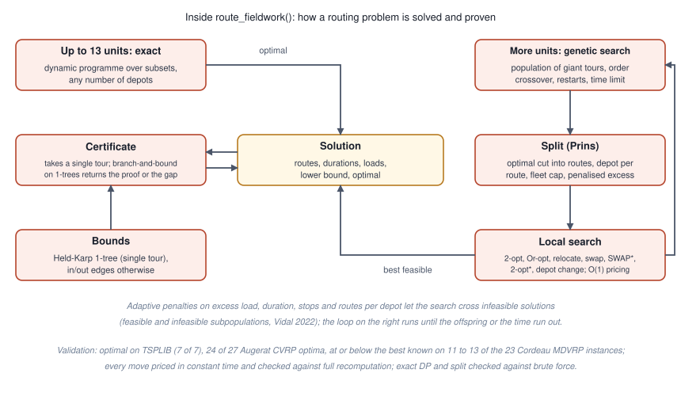

<!-- Generated from validation.Rmd.orig by tools/precompute-vignettes.R; edit the .orig file. -->


This vignette records how the package was checked: the routing solver
against public benchmark instances and other solvers, and the estimators by
simulation. The large runs were done once, outside the package build, with
the scripts of the `fieldopt-core` repository; the small ones run here.

## The routing solver

<div class="figure">

<p class="caption">Figure of the chunk unnamed-chunk-2</p>
</div>

Instances with rounded Euclidean distances, as the libraries define them,
one core of a laptop, one seed; "proven" means the certificate closed the gap
within ten seconds:

| Set | Instances | Setting | Optimal | Mean gap | Largest gap | Time |
|-----------------------|---:|---------------|-------------:|-------:|-------:|-----------:|
| TSPLIB (51 to 101 nodes) | 7 | 2000 offspring | 7 of 7 (6 proven) | 0.00% | 0.00% | 0.7 to 4.7 s |
| Augerat A (CVRP, 31 to 79 customers) | 27 | 200 offspring (default) | 14 of 27 | 0.20% | 1.14% | under 0.4 s |
| Augerat A | 27 | 2000 offspring | 24 of 27 | 0.01% | 0.15% | 0.7 to 4 s |
| Cordeau MDVRP (50 to 360 customers, 2 to 6 depots) | 23 | 2000 offspring | 11 of 23 at or below best known | 0.29% | 1.5% | 1 to 26 s |
| Cordeau MDVRP | 23 | 20 s each | 13 of 23 at or below best known | 0.26% | 1.9% | 20 s |

Other solvers on the same instances: PyVRP through the `vrpr` package
reaches 18 of 27 Augerat optima in one second and 24 in five (mean gap
0.05%); HiGHS on the compact MTZ formulation solves the TSP up to 51 nodes
(21 s) but stays 40 to 60 percent away from the optimum after three
minutes on the smallest Augerat instances, which is why the package does
not route with a general MIP solver.

Stability: across eight seeds on four instances the gap moved by less than
one percentage point (standard deviation below 0.3 points).

Internal checks in the engine's test suite: every local-search move is
priced in constant time and was checked against a full recomputation on
tens of thousands of accepted moves; the exact dynamic programme and the
split of giant tours were checked against brute force on hundreds of random
instances with one to three depots and asymmetric costs; the lower bounds
never exceed the exact optimum; an independent review found and fixed four
defects before release.

## The estimators

Small Monte Carlo checks, run here, of the unbiasedness of the main
estimators.


``` r
set.seed(4)
cells <- expand_grid(x = 1:15, y = 1:15) |> mutate(unit = paste0("c", row_number()))
areas <- expand_grid(unit = cells$unit, k = 1:3) |>
  transmute(unit, establishment = paste0(unit, "-", k), area = 0.3, y = rlnorm(n(), 2, 0.5))
deff <- point_design_effect(cells, areas, n = 25, points_per_cell = 6, cell_size = 1, n_sim = 60, seed = 2)
deff |> select(bias, variance, mean_variance_estimate, deff)
#> # A tibble: 1 × 4
#>     bias variance mean_variance_estimate   deff
#>    <dbl>    <dbl>                  <dbl>  <dbl>
#> 1 56.127  158401.                170292. 1.4716
```


``` r
set.seed(7)
cells <- cells |>
  mutate(domain = if_else(runif(n()) < 0.2, "ab", "a"), yv = if_else(domain == "ab", 80, 10) + rnorm(n(), sd = 3))
overlap <- cells |> filter(domain == "ab")
lst <- bind_rows(overlap |> transmute(unit = paste0("l", row_number()), domain, yv),
                 tibble(unit = paste0("b", 1:12), domain = "b", yv = 120 + rnorm(12, sd = 5))) |>
  mutate(x = runif(n()), y = runif(n()))
truth <- sum(cells$yv) + sum(lst$yv[lst$domain == "b"])
est <- map(1:40, \(k) {
  sa <- cells |> select_units(n = 30, seed = k)
  sb <- lst |> select_units(n = 15, method = "srs", seed = k)
  tibble(hartley = dual_frame_estimator(sa, sb, "yv", "domain")$total,
         fb = dual_frame_estimator(sa, sb, "yv", "domain", estimator = "fuller-burmeister")$total)
}) |> list_rbind()
est |> summarise(across(everything(), mean)) |> mutate(truth = truth, .before = 1)
#> # A tibble: 1 × 3
#>    truth hartley     fb
#>    <dbl>   <dbl>  <dbl>
#> 1 6182.1  6217.7 6242.3
est |> summarise(across(everything(), \(e) round(100 * (mean(e) - truth) / truth, 2)))   # relative bias in percent
#> # A tibble: 1 × 2
#>   hartley    fb
#>     <dbl> <dbl>
#> 1    0.58  0.97
```

Further checks live in the test suite: the Hartley allocation against a
grid search over the mixing weight, Cochran's two-stage optimum against
enumeration, the multivariate allocation against an integer grid, the cube
method's balance against simple random sampling, and the `survey` designs
produced by `as_svydesign()` against the package's own totals and replicate
variances.
